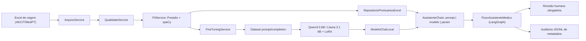
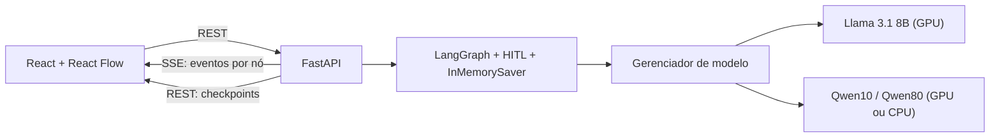
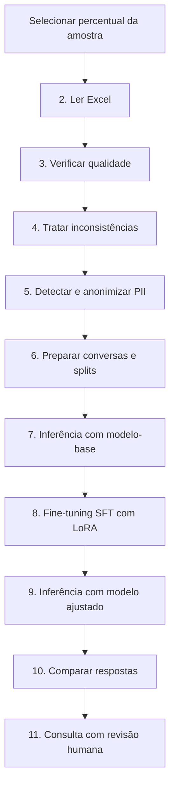
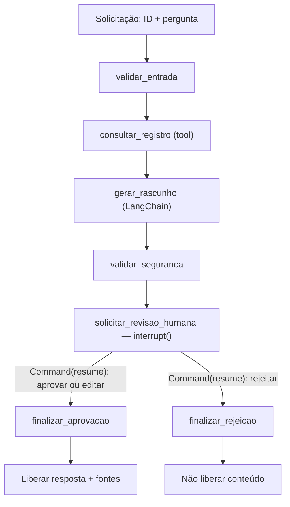

# Assistente Clínico com LLM ajustada (LoRA), LangChain e LangGraph

**Tech Challenge — Fase 3 · FIAP Pós-Tech em IA para Devs · Grupo 88**

Este repositório implementa, de ponta a ponta, um **assistente virtual médico
treinado com dados próprios**: um pipeline Python 3.12 que prepara, audita e
anonimiza um corpus clínico em português, realiza **fine-tuning SFT/LoRA** de
uma LLM, e expõe o modelo ajustado em um **fluxo de decisão automatizado com
LangChain e LangGraph**, com **revisão humana obrigatória** antes de qualquer
liberação de conteúdo.

O assistente permite alternar entre três modelos ajustados: Llama 3.1 8B (QLoRA,
GPU), Qwen3-0.6B treinado com 10% do corpus e Qwen3-0.6B treinado com 80% do
corpus (ambos com fallback em CPU).

> **Uso exclusivamente acadêmico e experimental.** O sistema não foi validado
> como dispositivo médico e não deve diagnosticar, prescrever, recomendar dose,
> realizar triagem de emergência, atualizar prontuários ou tomar qualquer decisão
> clínica autônoma. Toda saída do assistente é um rascunho probabilístico e só é
> liberada depois de uma decisão humana explícita.

---


## Sumário

1. [Matriz de atendimento ao enunciado](#matriz-de-atendimento-ao-enunciado)
2. [Como executar](#como-executar) — [Docker Compose](#opção-a--docker-compose-recomendado) · [manual](#opção-b--execução-manual-sem-docker)
3. [Como usar a aplicação](#como-usar-a-aplicação)
4. [Pipeline pelo menu de linha de comando](#pipeline-pelo-menu-de-linha-de-comando)
5. [Arquitetura](#arquitetura)
6. [Estrutura do projeto](#estrutura-do-projeto)
7. [Dados: preparação, curadoria e anonimização](#dados-preparação-curadoria-e-anonimização)
8. [Fine-tuning da LLM](#fine-tuning-da-llm)
9. [Avaliação do modelo e análise dos resultados](#avaliação-do-modelo-e-análise-dos-resultados)
10. [Assistente com LangChain](#assistente-com-langchain)
11. [Fluxo LangGraph e revisão humana](#fluxo-langgraph-e-revisão-humana)
12. [API REST/SSE](#api-restsse)
13. [Segurança, auditoria e explicabilidade](#segurança-auditoria-e-explicabilidade)
14. [Artefatos, validação e limitações](#artefatos-validação-e-limitações)
15. [Relatório técnico](#relatório-técnico)

---


## Matriz de atendimento ao enunciado


| Requisito do enunciado (Fase 3)                                  | Implementação no repositório                                                                            | Onde verificar                                                                                 |
| ---------------------------------------------------------------- | ------------------------------------------------------------------------------------------------------- | ---------------------------------------------------------------------------------------------- |
| Fine-tuning de LLM com dados médicos internos                    | `FineTuningService` monta as conversas e executa SFT + PEFT/LoRA sobre `Qwen/Qwen3-0.6B` e Llama 3.1 8B | `[fine_tuning_service.py](fine-tunning-llm/app/services/fine_tuning_service.py)` · opções 6–10 |
| Preprocessing, anonimização e curadoria                          | `ArquivoService`, `QualidadeService` e `PiiService` (Presidio + spaCy `pt_core_news_sm` + CPF)          | [Dados](#dados-preparação-curadoria-e-anonimização) · opções 2–5                               |
| Pipeline LangChain integrando a LLM customizada                  | `ModeloChatLocal` (`BaseChatModel`) + `AssistenteChain` em LCEL (`prompt | modelo | parser`)            | `[chain.py](fine-tunning-llm/app/assistente/chain.py)`                                         |
| Consulta a base de dados estruturada                             | Tool LangChain`buscar_prontuario` sobre `RepositorioProntuariosExcel` (allowlist + ID único)            | `[repositorio.py](fine-tunning-llm/app/assistente/repositorio.py)`                             |
| Respostas contextualizadas com dados do paciente                 | Contexto do registro serializado em JSON e injetado no prompt como dado**não executável**               | [Assistente](#assistente-com-langchain)                                                        |
| Fluxos de decisão automatizados e seguros                        | Grafo LangGraph de 7 nós com rota condicional,`interrupt()` e `Command(resume=...)`                     | `[fluxo.py](fine-tunning-llm/app/assistente/fluxo.py)`                                         |
| Limites de atuação (nunca prescrever sem validação)              | Prompt restritivo, 4 seções obrigatórias, alertas determinísticos e HITL bloqueante                     | [Segurança](#segurança-auditoria-e-explicabilidade)                                            |
| Logging detalhado para rastreamento e auditoria                  | `ServicoAuditoriaAssistente` (JSONL sanitizado) + log de checkpoints do `InMemorySaver` na interface    | [Auditoria](#segurança-auditoria-e-explicabilidade)                                            |
| Explainability (indicar a fonte da informação)                   | Campos-fonte determinísticos exibidos ao revisor e gravados na auditoria                                | [Explicabilidade](#segurança-auditoria-e-explicabilidade)                                      |
| Projeto modularizado em Python                                   | Camadas`app/services`, `app/assistente`, `app/api` e frontend isolado                                   | [Estrutura](#estrutura-do-projeto)                                                             |
| Instruções completas no README                                   | Execução com Docker Compose e manual, uso da interface e do menu CLI                                    | [Como executar](#como-executar)                                                                |
| Dataset anonimizado / dados sintéticos                           | Corpus público AKCIT/MedPT anonimizado pelo pipeline; exemplos deste README são sintéticos              | [Dados](#dados-preparação-curadoria-e-anonimização)                                            |
| Relatório técnico (fine-tuning, assistente, diagrama, avaliação) | Fonte LaTeX pronta para Overleaf em`relatorio/`                                                         | [Relatório técnico](#relatório-técnico)                                                        |


PubMedQA e MedQuAD são referências sugeridas no enunciado, mas não fazem parte
do código executado. O corpus efetivamente utilizado é o
[AKCIT/MedPT](https://huggingface.co/datasets/AKCIT/MedPT), em português, que
passa integralmente pelo pipeline de qualidade e anonimização antes do treino.

---


## Como executar

Há dois caminhos: **Docker Compose** (mais simples, sobe backend e frontend
juntos) e **execução manual** (útil para desenvolvimento e para rodar o pipeline
de fine-tuning). Ambos partem da raiz do repositório.

### Pré-requisitos


| Cenário                | Requisitos                                                              |
| ---------------------- | ----------------------------------------------------------------------- |
| Docker Compose         | Docker Engine 24+ com Compose v2; ~15 GB livres para cache e adapters   |
| Docker Compose + GPU   | Adicionalmente: driver NVIDIA e NVIDIA Container Toolkit                |
| Execução manual        | Python 3.12, Node.js 18+, ~15 GB livres                                 |
| Fine-tuning (opções 8) | CPU/RAM e várias horas de execução; o treino registrado levou ~10h29min |
| Modelo Llama 3.1 8B    | GPU CUDA obrigatória; os modelos Qwen rodam em CPU                      |


Em qualquer cenário é necessário o arquivo
`fine-tunning-llm/app/data/processado/dados_medicos_auditoria.xlsx` (gerado pelo
pipeline nas opções 2–5) para que o assistente consiga consultar registros.

### Opção A — Docker Compose (recomendado)

O `docker-compose.yml` fica na **raiz do repositório** e constrói dois serviços:
`backend` (FastAPI + modelo) e `frontend` (build Vite servido por Nginx com
proxy `/api`).

```bash
# 1. (Opcional) configure variáveis de ambiente
cp .env.example .env      # ajuste HF_TOKEN / APP_DEFAULT_MODEL se necessário

# 2. CPU — modelos Qwen
docker compose up --build

# 3. GPU NVIDIA — habilita também o Llama 3.1 8B
docker compose -f docker-compose.yml -f docker-compose.gpu.yml up --build
```

Depois do build, abra **[http://localhost:8080](http://localhost:8080)**. A API fica em
[http://localhost:8000/api/health](http://localhost:8000/api/health) e a documentação interativa em
[http://localhost:8000/docs](http://localhost:8000/docs).


| Detalhe              | Comportamento                                                                            |
| -------------------- | ---------------------------------------------------------------------------------------- |
| Contexto de build    | `./fine-tunning-llm` (os Dockerfiles continuam junto do código da aplicação)             |
| Dados clínicos       | `./fine-tunning-llm/app/data/processado` é montado **somente leitura** dentro do backend |
| Relatórios/auditoria | `./fine-tunning-llm/app/data/relatorios` é montado com escrita para receber o JSONL      |
| Cache e adapters     | Volumes nomeados`hf-cache` e `adapters` (persistem entre execuções)                      |
| Ordem de subida      | O frontend só inicia após o healthcheck`GET /api/health` do backend responder            |
| Primeiro uso         | O backend baixa os adapters ausentes do Hugging Face; pode demorar alguns minutos        |


Comandos úteis:

```bash
docker compose logs -f backend     # acompanhar o carregamento do modelo
docker compose config              # validar a composição sem subir nada
docker compose down                # parar tudo (mantém os volumes)
docker compose down -v             # parar e descartar cache/adapters
```


### Opção B — Execução manual (sem Docker)


#### B.1 — Caminho rápido com scripts

```bash
cd fine-tunning-llm
./scripts/setup_local.sh     # cria .venv, instala dependências e o modelo spaCy
hf auth login                # apenas se for baixar adapters privados
./scripts/run_local.sh       # sobe FastAPI (8000) e Vite (5173) juntos
```

Abra **[http://localhost:5173](http://localhost:5173)**.

Os dois scripts validam o ambiente antes de agir e falham com mensagem
acionável (Python ausente ou antigo, módulo `venv` não instalado, Node abaixo
da versão mínima, porta ocupada). Comportamento ajustável por variáveis:


| Variável     | Padrão    | Efeito                                                            |
| ------------ | --------- | ----------------------------------------------------------------- |
| `PYTHON_BIN` | detectado | Interpretador a usar (o script prefere`python3.12`, aceita 3.10+) |
| `PORT_API`   | `8000`    | Porta da API                                                      |
| `PORT_WEB`   | `5173`    | Porta do Vite                                                     |
| `HOST_BIND`  | `0.0.0.0` | Interface de escuta                                               |


```bash
# Exemplo: interpretador específico e portas alternativas
PYTHON_BIN=/usr/bin/python3.13 ./scripts/setup_local.sh
PORT_API=8123 PORT_WEB=5199 ./scripts/run_local.sh
```

O `setup_local.sh` é idempotente e, se o repositório tiver sido movido ou
renomeado, conserta sozinho os *console scripts* do venv cujo shebang aponta
para o caminho antigo.

#### B.2 — Passo a passo detalhado

**1. Confirmar o Python 3.12**

```bash
python --version      # deve começar com "Python 3.12"; no Windows: py -3.12 --version
```

**2. Criar e ativar o ambiente virtual** (a partir de `fine-tunning-llm/`)

```bash
cd fine-tunning-llm
python3.12 -m venv .venv
source .venv/bin/activate
```

No PowerShell:

```powershell
py -3.12 -m venv .venv
.\.venv\Scripts\Activate.ps1
# Se a política bloquear, libere apenas na sessão atual:
# Set-ExecutionPolicy -Scope Process -ExecutionPolicy Bypass
```

**3. Instalar as dependências Python**

```bash
python -m pip install --upgrade pip setuptools wheel
python -m pip install -r requirements.txt
python -m pip check
```

**4. Instalar o modelo de português do spaCy** (usado na anonimização)

```bash
python -m spacy download pt_core_news_sm
python -m spacy validate
```

**5. Preparar o cache do Hugging Face**

Use o comando atual `hf`; `huggingface-cli` está descontinuado.

```bash
hf version
hf download Qwen/Qwen3-0.6B
python -c "from huggingface_hub import snapshot_download; print(snapshot_download(repo_id='Qwen/Qwen3-0.6B', local_files_only=True))"
```

O serviço usa `snapshot_download(..., local_files_only=True)`: depois do download
inicial a execução reutiliza o cache e não dispara downloads automáticos. Para
usar outro disco, defina `HF_HOME` antes do download **e** antes de cada
execução (evite `hf download --local-dir`, pois o código procura o snapshot na
estrutura de cache do Hub):

```bash
export HF_HOME="/caminho/para/huggingface-cache"    # PowerShell: $env:HF_HOME = "D:\huggingface-cache"
```

**6. Configurar variáveis de ambiente (opcional)**

```bash
cp .env.example .env    # dentro de fine-tunning-llm/
```


| Variável                | Função                                                       |
| ----------------------- | ------------------------------------------------------------ |
| `HF_TOKEN`              | Token do Hugging Face (só necessário para adapters privados) |
| `APP_DEFAULT_MODEL`     | Modelo carregado por padrão (`llama`, `qwen10` ou `qwen80`)  |
| `APP_MEDICAL_DATA_FILE` | Caminho alternativo do Excel anonimizado                     |
| `APP_CORS_ORIGINS`      | Origens liberadas no CORS da API                             |


**7. Subir backend e frontend**

```bash
# Terminal 1 — API
uvicorn app.api.main:app --reload --port 8000

# Terminal 2 — interface
npm --prefix frontend install
npm --prefix frontend run dev
```

**8. Executar o pipeline de dados e o fine-tuning (quando desejado)**

```bash
python main.py        # menu Rich com as opções 0–12
```

---


## Como usar a aplicação

1. **Escolha o modelo** no seletor (Llama exige CUDA; Qwen10/Qwen80 rodam em
  CPU). Trocar de modelo descarrega o anterior — apenas um permanece em memória.
2. **Escolha o prontuário** no campo *Prontuário*. Ele funciona de dois modos:
  - **busca**: digite um texto (`cardiologista`, `sopros`, `diagnóstico`) e
   selecione um caso na lista, que mostra `#id · especialidade · hipótese`;
  - **ID direto**: digite o número do registro (ex.: `26`) — útil para
  reproduzir um caso específico durante uma avaliação.
   Ao **selecionar** um caso da lista, a **pergunta original daquele registro**
   é carregada automaticamente no campo de texto. Isso mantém pergunta e
   contexto clínico coerentes entre si, já que no corpus cada prontuário vem
   acompanhado da pergunta que o originou. O texto continua editável.
3. **Acompanhe o fluxo em tempo real**: o painel direito desenha o grafo
  LangGraph e acende cada nó conforme os eventos SSE chegam, com a duração de
   cada etapa e uma linha do tempo.
4. **Monitore a persistência do grafo**: o painel *InMemorySaver*, no **canto
  inferior direito**, lista os checkpoints gravados pelo checkpointer do
   LangGraph — passo, origem (`input`/`loop`/`update`), próximos nós, chaves
   escritas no estado e a marcação `interrupt` no momento da pausa para revisão.
   O painel é recolhível e mostra apenas metadados, nunca conteúdo clínico.
5. **Revise o rascunho** na janela HITL: o conteúdo **não é liberado** antes da
  decisão. É possível **aprovar**, **rejeitar** ou **editar e aprovar**.
6. **Confira as fontes e os alertas** exibidos junto ao rascunho antes de aprovar.

Se a resposta for rejeitada, nenhum texto é publicado — a interface apenas
registra a rejeição.

---


## Pipeline pelo menu de linha de comando

```bash
cd fine-tunning-llm && python main.py
```

Antes do menu, informe um percentual maior que zero e menor ou igual a 100 da
amostra a ser processada. O fluxo garante ao menos três exemplos para distribuir
treino, validação e teste.


| Opção | Ação                                     | Dependência principal                              |
| ----- | ---------------------------------------- | -------------------------------------------------- |
| `0`   | Executa as etapas 2–6                    | Arquivo de origem presente; não inicia treinamento |
| `1`   | Executa as etapas 7–10                   | Dataset preparado, cache do Qwen e LoRA para 9–10  |
| `2`   | Lê e amostra o Excel                     | Arquivo de origem                                  |
| `3`   | Analisa duplicidades e ausências         | Etapa 2 na mesma sessão                            |
| `4`   | Remove inconsistências                   | Etapa 2 na mesma sessão                            |
| `5`   | Detecta e anonimiza PII                  | Etapa 4 e modelo spaCy                             |
| `6`   | Prepara conversas e splits               | Etapas 2–5 e cache do Qwen                         |
| `7`   | Executa inferência-base                  | Dataset válido e cache do Qwen                     |
| `8`   | Executa SFT/LoRA                         | Dataset, cache, CPU/RAM/tempo suficientes          |
| `9`   | Executa inferência ajustada              | Dataset, cache e adaptador LoRA                    |
| `10`  | Compara as inferências                   | Saídas das etapas 7 e 9                            |
| `11`  | Consulta o assistente com revisão humana | Excel anonimizado, cache e adaptador               |
| `12`  | Encerra a aplicação                      | Nenhuma                                            |


Fluxo recomendado: `0` → `1` → `11`. Para executar granularmente, use `2` → `3`
→ `4` → `5` → `6` na mesma sessão; depois `7` → `8` → `9` → `10`; por fim `11`.
A opção `11` reproduz no terminal o mesmo grafo LangGraph com HITL usado pela
interface web.

---


## Arquitetura

Pipeline de dados e treinamento:




Camada de aplicação (frontend + API), sem substituir o pipeline:




Sequência do pipeline pelo menu:




---


## Estrutura do projeto

```text
.
├── docker-compose.yml              # stack completa (raiz do repositório)
├── docker-compose.gpu.yml          # override para GPU NVIDIA
├── .env.example                    # variáveis lidas pelo Compose
├── README.md
├── relatorio/                      # relatório técnico em LaTeX (Overleaf)
├── data_huggingface/               # origem do corpus (AKCIT/MedPT) em partes
├── tech_challenge_fase_3.ipynb     # notebook de exploração/preparação (Colab)
├── separador_arquivos.py           # utilitário para dividir o Excel de origem
└── fine-tunning-llm/               # aplicação
    ├── main.py                     # menu Rich do pipeline (opções 0–12)
    ├── analisar_tokens.py
    ├── requirements.txt
    ├── Dockerfile.backend
    ├── Dockerfile.frontend
    ├── deploy/nginx.conf
    ├── scripts/                    # setup_local.sh, run_local.sh, entrypoint
    ├── frontend/                   # React + Vite + React Flow
    └── app
        ├── api/                    # FastAPI, SSE, sessões transitórias
        ├── assistente/             # LangChain + LangGraph + auditoria
        ├── services/               # arquivo, qualidade, PII, fine-tuning
        ├── config.py
        ├── data/                   # original, processado, relatorios
        └── modelos/                # adapters LoRA locais
```


| Caminho                               | Responsabilidade                                                     |
| ------------------------------------- | -------------------------------------------------------------------- |
| `docker-compose.yml`                  | Backend e frontend em serviços separados, a partir da raiz           |
| `fine-tunning-llm/main.py`            | Interface Rich, estado da sessão, atalhos do pipeline e HITL         |
| `app/services/arquivo_service.py`     | Leitura, amostragem e gravação atômica de Excel                      |
| `app/services/qualidade_service.py`   | Relatório e tratamento de duplicidades/ausências                     |
| `app/services/pii_service.py`         | Detecção e anonimização de PII/PHI                                   |
| `app/services/fine_tuning_service.py` | Dataset, treinamento, inferência e avaliação                         |
| `app/assistente/repositorio.py`       | Consulta controlada ao Excel anonimizado (allowlist + ID único)      |
| `app/assistente/ferramentas.py`       | Tool LangChain`buscar_prontuario`                                    |
| `app/assistente/modelo_chat.py`       | Adaptador`BaseChatModel` para o LoRA local                           |
| `app/assistente/chain.py`             | Prompt, LCEL, parser, seções e aviso determinístico                  |
| `app/assistente/fluxo.py`             | Grafo LangGraph,`interrupt`, decisão humana e leitura de checkpoints |
| `app/assistente/auditoria.py`         | Eventos JSONL sem conteúdo clínico                                   |
| `app/api/`                            | Endpoints REST, SSE e sessões transitórias                           |
| `frontend/src/App.tsx`                | Chat, grafo animado, HITL e painel de logs do`InMemorySaver`         |


Uma descrição complementar das etapas está em
`[fine-tunning-llm/FLUXO_PIPELINE.md](fine-tunning-llm/FLUXO_PIPELINE.md)`.

### Tecnologias

Python 3.12 · pandas/openpyxl/PyArrow · Rich · Microsoft Presidio e spaCy ·
PyTorch e Transformers · Hugging Face Datasets/Hub/Evaluate · TRL e PEFT/LoRA ·
LangChain e LangGraph · FastAPI e SSE · React, Vite e React Flow · Docker
Compose e Nginx.

O pacote `langchain-openai` está declarado nas dependências, mas o fluxo
descrito aqui **não usa API externa**: o assistente chama somente o modelo LoRA
local.

---


## Dados: preparação, curadoria e anonimização


### Arquivo de entrada

O Excel de origem deve existir em
`fine-tunning-llm/app/data/original/dados_medicos_base.xlsx` (montado a partir
do corpus [AKCIT/MedPT](https://huggingface.co/datasets/AKCIT/MedPT), dividido em
partes em `data_huggingface/`). O original é somente leitura; transformações são
gravadas nas pastas de processamento, relatórios ou modelos.

Colunas principais esperadas: `id`, `papel_solicitante`, `contexto_solicitacao`,
`pergunta_original`, `prontuario_contexto`, `resposta_estruturada`,
`especialidade_medica` e `tipo_pergunta`. A ausência de campos obrigatórios
interrompe a etapa com mensagem descritiva.

### Qualidade e preprocessing (etapas 3 e 4)

Verificam e removem registros duplicados ou com campos monitorados ausentes,
gerando relatórios antes e depois do tratamento.

### Anonimização (etapa 5)

Presidio e `pt_core_news_sm` buscam `PERSON`, `PHONE_NUMBER`, `DATE_TIME` e
`CPF` (reconhecedor customizado) nas colunas configuradas, produzindo
`pergunta_original_anonimizado` e `prontuario_contexto_anonimizado` com
marcadores no lugar dos identificadores.

A detecção automática reduz risco, mas **não garante** remoção completa de
PII/PHI. A curadoria humana deve revisar falsos positivos/negativos,
minimização, base legal, retenção, controle de acesso e aderência à LGPD —
inclusive em `papel_solicitante`, `contexto_solicitacao` e
`resposta_estruturada`, que participam das conversas de treino.

### Dataset conversacional (etapa 6)


| Campo                      | Finalidade                                              |
| -------------------------- | ------------------------------------------------------- |
| `id_exemplo`               | Identificador único                                     |
| `system`                   | Política de comportamento e formato                     |
| `user`                     | Papel, solicitação, prontuário e pergunta anonimizados  |
| `assistant`                | Resposta de referência                                  |
| `especialidade_medica`     | Metadado preservado                                     |
| `tipo_pergunta`            | Metadado preservado                                     |
| `total_okens_fine_tunning` | Quantidade de tokens; grafia legada mantida pelo código |
| `split`                    | `treino`, `validacao` ou `teste`                        |


As conversas viram `prompt` (`system` + `user`) e `completion` (`assistant`),
com perda calculada apenas sobre a completion. O split usa seed 42 e alvo
80%/10%/10%, preservando ao menos um item de validação e um de teste em
conjuntos pequenos. Exemplos com 512 tokens ou mais são removidos e os splits
recalculados. O conjunto de teste não participa do `SFTTrainer`.

Exemplo **exclusivamente sintético**:

```json
{
  "id_exemplo": "DEMO-0001",
  "system": "Você é um assistente acadêmico de apoio clínico...",
  "user": "Prontuário fictício sem identificadores. Quais pontos devem ser revisados?",
  "assistant": "Resposta: exemplo sintético. Considerações clínicas: revisar contexto. Conduta/Orientação: submeter ao profissional. Limitações: não é orientação clínica.",
  "split": "teste"
}
```

---


## Fine-tuning da LLM


### Escolha dos modelos-base

Foram ajustados **dois** modelos, deliberadamente em extremos opostos da curva
custo/capacidade, para poder comparar o que se ganha e o que se paga:

**Qwen3-0.6B — o modelo portátil.** Escolhido por (i) suporte nativo a
português; (ii) licença Apache 2.0, que permite redistribuir o adaptador;
(iii) tamanho que cabe em CPU, garantindo que o projeto seja reproduzível por
quem não tem GPU; e (iv) *chat template* próprio com `enable_thinking=False`,
que evita respostas com raciocínio explícito e produz direto o formato de quatro
seções exigido.

O preço dessa portabilidade aparece na superfície do texto: **um modelo de 0,6 B
erra português**. Grafia, concordância e pontuação falham com frequência
perceptível, e há erros de conteúdo que nenhuma validação de formato captura. O
projeto trata isso como característica conhecida do porte do modelo, não como
algo a esconder — daí a validação determinística de formato e a revisão humana
obrigatória antes de qualquer liberação. Os erros observados na 2ª rodada de
avaliação estão em
[Comparação qualitativa dos chatbots](#comparação-qualitativa-dos-chatbots-duas-rodadas-de-20-casos)
e em [Limitações conhecidas](#limitações-conhecidas).

**Llama 3.1 8B Instruct — o teto de qualidade.** Escolhido para medir quanto o
0.6B deixa na mesa. Usa **QLoRA em 4 bits** (base `unsloth/Meta-Llama-3.1-8B- Instruct-bnb-4bit`) com Unsloth, o que torna viável treinar um modelo de 8B em
uma única GPU de consumo. Em contrapartida, **exige CUDA** também na inferência.

Manter os dois no assistente é uma decisão de projeto: o seletor de modelo da
interface permite demonstrar o mesmo fluxo clínico com o modelo que roda em
qualquer máquina e com o modelo que entrega a melhor resposta.

### Matriz de experimentos

Foram executadas cinco corridas de treinamento. Todas usam SFT com PEFT/LoRA,
3 épocas, `learning rate` 1e-4, lote efetivo 8 e `seed=42`.


| #   | Adaptador (`app/modelos/`)                                | Modelo-base  | Dispositivo | Precisão                | Projeções LoRA | Treináveis          | Exemplos (treino) | `max_len` | Passos |
| --- | --------------------------------------------------------- | ------------ | ----------- | ----------------------- | -------------- | ------------------- | ----------------- | --------- | ------ |
| A   | `qwen3_06b_lora_cpu`                                      | Qwen3-0.6B   | **CPU**     | `float32`               | q, v           | 2.293.760 (0,383%)  | 1.042             | 512       | 393    |
| B   | `qwen_06b_lora_gpu/qwen3_06b_lora_10pct`                  | Qwen3-0.6B   | GPU         | `bfloat16`              | q, v           | 2.293.760 (0,383%)  | 1.045             | 512       | 393    |
| C   | `qwen_06b_lora_gpu/qwen3_06b_lora_80pct`                  | Qwen3-0.6B   | GPU         | `bfloat16`              | q, v           | 2.293.760 (0,383%)  | 11.623            | 1024      | 4.359  |
| D   | `qwen_06b_lora_gpu/qwen3_06b_lora_80pct_more_projections` | Qwen3-0.6B   | GPU         | `bfloat16`              | q, k, v, o     | 4.587.520 (0,764%)  | 11.623            | 1024      | 4.359  |
| E   | `llama31_8b_instruct_lora_gpu`                            | Llama 3.1 8B | GPU         | QLoRA 4-bit +`bfloat16` | q, k, v, o     | 13.631.488 (0,299%) | 6.921             | 512       | 2.598  |


**A e B são a mesma configuração em dispositivos diferentes** — é esse par que
isola o efeito de CPU vs. GPU. O assistente expõe A (`qwen10`), D (`qwen80`) e
E (`llama`).

Detalhes por corrida: `Llama3.1-8b-QLoRA/metricas_fine_tuning.txt` e
`Qwen3-0.6B/experimento_*/metricas_fine_tuning.txt`, em
`[app/data/relatorios/](fine-tunning-llm/app/data/relatorios)`.

### Hiperparâmetros comuns


| Parâmetro              | Valor implementado                                     |
| ---------------------- | ------------------------------------------------------ |
| Método                 | SFT com TRL e PEFT/LoRA para`CAUSAL_LM`                |
| Épocas                 | 3                                                      |
| Learning rate          | `1e-4`                                                 |
| Lote efetivo           | 8 (via acumulação de gradiente)                        |
| LoRA                   | `r=16`, alpha 32, `bias="none"`                        |
| Dropout LoRA           | 0,05 (Qwen) · 0,0 (Llama, com*packing*)                |
| Avaliação e checkpoint | A cada época; até 2 checkpoints; melhor por`eval_loss` |
| Reprodutibilidade      | `seed=42` e `data_seed=42`                             |
| Otimizador             | AdamW (Qwen) · Paged AdamW 8-bit (Llama QLoRA)         |
| Geração                | Determinística, sem thinking, até 384 tokens novos     |


O tokenizer aplica o chat template do modelo com `enable_thinking=False` e a
entrada é truncada à esquerda. Resultados podem variar por versões, hardware e
dados locais.

---


## Avaliação do modelo e análise dos resultados


### Comparação entre os modelos

Todas as métricas são do conjunto de **validação**, que não participa da
atualização de pesos.


| #   | Adaptador              | Loss (base → ajustado) | Δ Loss | Acurácia/token (base → ajustado) | Perplexidade | Tempo de treino |
| --- | ---------------------- | ---------------------- | ------ | -------------------------------- | ------------ | --------------- |
| A   | Qwen 10%**CPU**        | 2,5002 →**0,6778**     | −72,9% | 52,12% →**86,41%**               | 1,97         | **~10h29min**   |
| B   | Qwen 10% GPU           | 2,5110 →**0,6595**     | −73,7% | 51,80% →**86,71%**               | 1,93         | **7min19s**     |
| C   | Qwen 80% GPU (q/v)     | — → 0,7680             | —      | — → 84,26%                       | 2,16         | —               |
| D   | Qwen 80% GPU (q/k/v/o) | 2,5211 →**0,7476**     | −70,3% | 51,10% →**84,58%**               | 2,11         | **44min29s**    |
| E   | **Llama 3.1 8B QLoRA** | 1,7524 →**0,4246**     | −75,8% | não registrada                   | **1,53**     | **2h32min**     |


Leituras principais:

- **O Llama 3.1 vence com folga em métrica de linguagem.** Loss final 0,4246 e
perplexidade 1,53, contra 0,6595 e 1,93 do melhor Qwen. Ele também **parte de
um patamar melhor** (loss inicial 1,75 vs. 2,51): o modelo de 8B já entendia
melhor a tarefa antes de qualquer ajuste.
- **O Qwen custa uma fração.** 7 minutos de GPU contra 2h32min, e 0,6 B
parâmetros contra 4,55 B (4-bit). Para uma demonstração que precisa rodar em
CPU, é o único dos dois viável.
- **Mais projeções ajudam pouco, mas ajudam.** Passar de `q,v` (C) para
`q,k,v,o` (D) no mesmo conjunto reduziu a loss de 0,7680 para 0,7476 (−2,7%)
ao custo de dobrar os parâmetros treináveis. Por isso D é o adaptador
publicado como `qwen80`.
- **Cuidado ao comparar C/D com A/B.** As corridas de 80% têm loss *pior* que as
de 10%, o que não significa modelo pior: elas usam `max_len` 1024 (sequências
mais longas e heterogêneas) e um conjunto de validação diferente. Loss só é
comparável entre corridas sobre a mesma distribuição — por isso o par CPU/GPU
(A/B) é o único comparativo estritamente controlado.


### Treinamento em CPU vs. GPU

A e B têm **configuração idêntica** (mesma amostra, `r=16`, projeções `q,v`,
512 tokens, lote 1×8, 3 épocas, `seed=42`) e diferem apenas no dispositivo e na
precisão. É o comparativo limpo:


| Medida                        | A — CPU (`float32`) | B — GPU (`bfloat16`) | Ganho da GPU |
| ----------------------------- | ------------------- | -------------------- | ------------ |
| Tempo de treino (393 passos)  | ~37.740 s (10h29)   | 438,8 s (7min19s)    | **~86×**     |
| Avaliação por época (130 ex.) | 606 s – 704 s       | 5,8 s – 6,9 s        | **~104×**    |
| Throughput de avaliação       | 0,215 amostras/s    | ~22 amostras/s       | **~102×**    |
| Melhor loss de validação      | 0,6778              | 0,6595               | −0,018       |
| Acurácia média por token      | 86,41%              | 86,71%               | +0,30 p.p.   |
| Perplexidade                  | 1,97                | 1,93                 | −0,04        |


**A conclusão é que o dispositivo praticamente não muda a qualidade, e muda tudo
no custo.** A diferença de loss (0,018) e de acurácia (0,3 p.p.) está na faixa
de ruído entre execuções; a diferença de tempo é de quase duas ordens de
grandeza. Consequências práticas adotadas no projeto:

- a **GPU é o ambiente de iteração** — foi o que permitiu rodar as cinco
corridas e a ablação de projeções;
- a **CPU é o ambiente de reprodutibilidade** — o adaptador `qwen10` treinado em
CPU é o padrão do Docker Compose, garantindo que qualquer avaliador consiga
executar o projeto sem GPU;
- o `float32` da CPU não trouxe vantagem de qualidade sobre o `bfloat16` da GPU,
o que remove o único argumento técnico que justificaria treinar em CPU por
escolha, e não por restrição.


### Comparação qualitativa dos chatbots (duas rodadas de 20 casos)

O comportamento observável foi medido em **duas rodadas**, e a diferença entre
elas importa para ler os números: a primeira mediu os modelos **isolados**,
antes de o pipeline LangChain/LangGraph existir; a segunda mediu o sistema como
ele é entregue, decompondo o que vem do modelo e o que vem da orquestração.

#### 1ª rodada — modelos isolados, anterior à integração do LangGraph

> **Leia com esta ressalva.** Esta rodada foi executada por
> `[comparar_qwen_llama.py](chatbot-modelo-fine-tunning/comparar_qwen_llama.py)`,
> que chama `model.generate` diretamente: **sem** LangChain, **sem** LangGraph e
> **sem** os controles anti-repetição (`repetition_penalty=1.15`,
> `no_repeat_ngram_size=4`) que o `FineTuningService` passou a aplicar depois.
> Os números abaixo — inclusive os *loops* do Qwen3-0.6B — descrevem o **modelo
> cru**, e não o comportamento do assistente entregue. As 20 perguntas também
> eram redigidas à mão e, quando derivadas de casos reais, podiam pertencer ao
> split de treino.

Resultado em
`[comparacao_chatbot_qwen_vs_llama_20q.md](fine-tunning-llm/app/data/relatorios/comparacao_chatbot_qwen_vs_llama_20q.md)`:


| Modelo                      | Média de seções (0–4) | Respostas 4/4 | *Loops*  | Média de caracteres |
| --------------------------- | --------------------- | ------------- | -------- | ------------------- |
| Qwen3-0.6B 80% (q/k/v/o)    | 3,1                   | 14/20         | 5/20     | 998                 |
| Llama 3.1 8B Instruct QLoRA | **3,9**               | **19/20**     | **1/20** | 965                 |


Placar direto: **Llama vence em 7**, Qwen em 1, empate em 12. A leitura da época
foi que o Llama respeita melhor o contrato de formato e degenera muito menos em
repetição — o que a perplexidade já indicava.

#### 2ª rodada — com o pipeline LangChain/LangGraph integrado

A segunda rodada refaz a medição sobre **20 casos do split de teste** (nunca
vistos em treino, um por especialidade, seleção determinística) em **três
braços**, executados pelo
`[comparar_chatbots_langgraph.py](fine-tunning-llm/scripts/comparar_chatbots_langgraph.py)`.
Cada braço adiciona uma camada, o que permite atribuir o ganho à camada certa:


| Braço                   | O que é                                                                            |
| ----------------------- | ---------------------------------------------------------------------------------- |
| `direto_sem_penalidade` | decoding da 1ª rodada — reproduz o método antigo no novo conjunto                  |
| `direto_com_penalidade` | via pública atual do serviço:`repetition_penalty=1.15`,`no_repeat_ngram_size=4`    |
| `pipeline_langgraph`    | fluxo completo: tool`buscar_prontuario`, chain,`validar_seguranca` e HITL aprovado |


Resultado em
`[comparacao_chatbots_langgraph_20q.md](fine-tunning-llm/app/data/relatorios/comparacao_chatbots_langgraph_20q.md)`.
As seções são contadas pelo **critério estrito** do nó `validar_seguranca`
(rótulo exato no início da linha), mais rigoroso que a busca por substring da
1ª rodada:


| Modelo             | Braço                   | Média de seções | Respostas 4/4 | *Loops*  | Média de caracteres |
| ------------------ | ----------------------- | --------------- | ------------- | -------- | ------------------- |
| Qwen3-0.6B 80%     | `direto_sem_penalidade` | 2,90            | 12/20         | **7/20** | 1.304               |
| Qwen3-0.6B 80%     | `direto_com_penalidade` | **4,00**        | **20/20**     | **0/20** | 905                 |
| Qwen3-0.6B 80%     | `pipeline_langgraph`    | **4,00**        | **20/20**     | **0/20** | 1.363               |
| Llama 3.1 8B QLoRA | `direto_sem_penalidade` | **4,00**        | **20/20**     | **0/20** | 936                 |
| Llama 3.1 8B QLoRA | `direto_com_penalidade` | **4,00**        | **20/20**     | **0/20** | 864                 |
| Llama 3.1 8B QLoRA | `pipeline_langgraph`    | **4,00**        | **20/20**     | **0/20** | 1.328               |


Placar par a par: **8–0 para o Llama** com o decoding antigo (12 empates), e
**20 empates** nos dois outros braços. Três conclusões:

- **os *loops* do Qwen não eram um problema de orquestração, e sim de
decoding.** Eles reaparecem em 7 de 20 casos quando se reproduz o método da
1ª rodada, e caem a **zero** apenas com `repetition_penalty` e
`no_repeat_ngram_size` — antes de o LangGraph entrar. É por isso que o número
“5/20 *loops*” da 1ª rodada **não** descreve o assistente entregue;
- **com o pipeline, os dois modelos empatam em formato.** A vantagem estrutural
do Llama, que era de 8–0 no método antigo, desaparece. O que restou de
diferença entre os modelos é conteúdo clínico, não formatação;
- **o pipeline custa caracteres, não tempo.** As respostas do braço
`pipeline_langgraph` são ~50% mais longas (fontes, aviso e seções
completadas), com tempo médio por caso equivalente (~12 s contra ~11 s).


#### O que a 2ª rodada revelou: 4/4 seções é mérito da chain, não do modelo

O braço `pipeline_langgraph` também mede o **texto bruto do modelo**, capturado
antes de `AssistenteChain` completar seções ausentes e anexar fontes. Aí o
resultado se inverte:


| Modelo             | Média de seções (bruto) | Respostas 4/4 (bruto) |
| ------------------ | ----------------------- | --------------------- |
| Qwen3-0.6B 80%     | 2,00                    | **0/20**              |
| Llama 3.1 8B QLoRA | 2,00                    | **0/20**              |


Nenhum dos dois modelos entrega as quatro seções no formato exigido quando o
prompt é o do assistente. A causa é a mesma nos 20 casos e nos dois modelos:
eles **erram a grafia de dois dos quatro títulos**.


| Título exigido            | Qwen3-0.6B escreve         | Llama 3.1 8B escreve      |
| ------------------------- | -------------------------- | ------------------------- |
| `Resposta:`               | `Resposta:` ✔              | `Resposta:` ✔             |
| `Considerações clínicas:` | `Considerações clíncimas:` | `Considerações clínicos:` |
| `Conduta/Orientação:`     | `Conduta/Orientações:`     | `Conduta/Orientación:`    |
| `Limitações:`             | `Limitações:` ✔            | `Limitações:` ✔           |


Vale registrar o que **não** é a causa: os títulos estão corretos em 14.567 de
14.567 respostas de referência do dataset, e nos braços `direto_*` — cujo prompt
reproduz o formato do treino — os dois modelos acertam os quatro títulos em
20/20. O erro aparece **apenas** sob o prompt do assistente, que é
off-distribution em relação ao fine-tuning (outra mensagem de sistema e contexto
em JSON). É deriva de prompt manifestando-se como erro de linguagem, e o modelo
pequeno não é o único afetado: o Llama chega a escrever o título em espanhol.

**E o** `validar_seguranca` **não acusa nada.** A chain completa as seções ausentes
*antes* de o nó de validação rodar, então os códigos `SECAO_*_AUSENTE` não têm
como disparar: os alertas foram **0 em 40 execuções**. O efeito colateral é que
o rascunho liberado carrega, em 20 de 20 casos, o par de seções duplicado — a
seção com o título errado e preenchida, seguida do stub automático
`Considerações clínicas: Informação insuficiente no contexto fornecido.` logo
abaixo, contradizendo o texto que acabou de ser escrito.

Isso não compromete a garantia de segurança do projeto — nada é liberado sem
aprovação humana, e é justamente o revisor que vê a inconsistência —, mas é uma
limitação real do desenho atual, registrada em
[Limitações conhecidas](#limitações-conhecidas): enquanto a chain preencher
antes da validação, o alerta de seção ausente é inalcançável.

#### Erros de linguagem: uma característica de porte, não um defeito do ajuste

Independentemente da deriva de prompt acima, **os modelos cometem erros de
português**, e o texto que chega ao revisor precisa de leitura editorial. Exemplos
colhidos nesta rodada: `O hipertireoidismos`, `Hipertireoidisme`,
`diagnósticos anteresiores`, `Não foram informações sobre`,
`avaliação clínICA` (Qwen3-0.6B) e `visão monolucar` no lugar de *monocular*
(Llama 3.1 8B). Há também erros de conteúdo que nenhuma validação de formato
captura — no caso C03 o Qwen afirma `O hipertireoidismo tem cura sim!` e depois
troca a hipótese por *Hipotireoidismo*.

É o limite de capacidade esperado de um modelo de 0,6 B parâmetros (e, em menor
grau, de um 8 B quantizado em 4 bits), não uma falha do fine-tuning. A
consequência de projeto é dupla: a **revisão humana obrigatória** deixa de ser
formalidade e passa a ser a etapa que efetivamente corrige o texto, e a
validação determinística de formato precisa ser lida como **um piso, não uma
garantia de qualidade**.

### Critérios da avaliação humana

As etapas 7, 9 e 10 produzem a comparação lado a lado (referência, modelo-base e
modelo ajustado) sobre os mesmos exemplos de teste. A avaliação manual considera:

- aderência às quatro seções exigidas;
- estrutura e relevância clínica;
- fidelidade ao contexto e aos campos-fonte;
- alucinação e afirmações sem sustentação;
- segurança da orientação;
- exposição de PII/PHI;
- limitações e capacidade de generalização.

Loss, perplexidade e acurácia por token **não substituem** avaliação humana nem
validação clínica: um modelo pode reproduzir com fluência uma conduta
inadequada.

---


## Assistente com LangChain

`ModeloChatLocal` implementa `BaseChatModel`, reúne mensagens de sistema e
usuário e chama `FineTuningService.gerar_resposta_modelo_ajustado`. Não há envio
de contexto a provedor externo. Apenas um modelo permanece carregado por vez; a
troca libera memória antes de carregar Llama, Qwen10 ou Qwen80.

`AssistenteChain` monta um `ChatPromptTemplate` e compõe em LCEL:

```text
prompt | ModeloChatLocal | StrOutputParser
```

O contexto estruturado é serializado como JSON e tratado como **dado não
executável**: instruções encontradas dentro do prontuário não devem ser
obedecidas (defesa contra prompt injection via dados).

A tool LangChain `buscar_prontuario` encapsula
`RepositorioProntuariosExcel`, que busca exatamente um ID e recusa registro
ausente ou duplicado. A allowlist expõe somente campos não vazios: prontuário
anonimizado, hipótese, diagnóstico, exames, medicamentos, alergias, antecedentes
e especialidade. As “fontes” mostradas ao revisor são os **nomes desses campos**,
não referências científicas inventadas pela LLM.

O seletor da interface é alimentado por `GET /api/registros`, que usa uma lista
de campos **separada** da allowlist acima (`CAMPOS_LISTAGEM`: especialidade,
hipótese, diagnóstico, tipo e contexto da solicitação, mais a pergunta original
anonimizada). Essa separação é deliberada: navegar pelos casos não altera o que
entra no prompt do modelo nem a lista de fontes exibida ao revisor.

O ID informado é normalizado e comparado por igualdade com a coluna `id`. A tool
devolve o ID encontrado e o grafo interrompe a execução se ele diferir do
solicitado. Isso garante a recuperação da linha correta; não garante que uma
pergunta de texto livre seja semanticamente relacionada ao caso — essa adequação
é conferida no HITL.

Todo rascunho deve conter: `Resposta`, `Considerações clínicas`,
`Conduta/Orientação` e `Limitações`.

---


## Fluxo LangGraph e revisão humana




O estado percorre os nós `validar_entrada`, `consultar_registro`,
`gerar_rascunho`, `validar_seguranca`, `solicitar_revisao_humana`,
`finalizar_aprovacao` e `finalizar_rejeicao`. Cada nó emite telemetria (início,
fim e duração) consumida pela interface via SSE.

### Persistência com `InMemorySaver`

O grafo é compilado com o checkpointer `InMemorySaver`, usando o
`id_execucao` como `thread_id`. É ele que permite pausar em `interrupt()` e
retomar com `Command(resume=...)` sem perder o estado intermediário.

`FluxoAssistenteMedico.historico_checkpoints()` lê esse checkpointer via
`get_state_history()` e devolve, em ordem cronológica, **apenas metadados**:


| Campo             | Significado                                                   |
| ----------------- | ------------------------------------------------------------- |
| `checkpoint_id`   | Identificador do checkpoint gerado pelo LangGraph             |
| `passo`           | Número do passo (`-1` é a entrada, depois 0, 1, 2, …)         |
| `origem`          | `input`, `loop` ou `update`                                   |
| `proximos_nos`    | Nós que serão executados a seguir (vazio =`END`)              |
| `chaves_gravadas` | Chaves**novas** no estado naquele passo (sem os valores)      |
| `chaves_estado`   | Chaves acumuladas no estado                                   |
| `interrompido`    | Indica o checkpoint em que o grafo pausou para revisão humana |


Esses registros alimentam o painel *InMemorySaver* no canto inferior direito da
interface. Como só trafegam nomes de chaves, o log é compatível com a política
de auditoria sem dados sensíveis.

`InMemorySaver` é adequado à demonstração local, mas **não é persistência
durável**: se o processo encerrar durante a revisão, a execução se perde.

### Revisão humana obrigatória (HITL)

Tanto na opção 11 do menu quanto na interface web, o sistema exibe rascunho,
fontes, alertas e aviso e exige **aprovar**, **rejeitar** ou **editar**. A edição
passa novamente pela validação de seções/aviso antes da liberação; a rejeição
não libera conteúdo algum.

Exemplo sintético no terminal:

```text
Opção: 11
ID do registro: DEMO-0001
Pergunta clínica: Em um cenário fictício, quais pontos exigem revisão?
Decisão do revisor: a
Observação: Aprovação exclusivamente demonstrativa.
```

---


## API REST/SSE


| Método e rota                                  | Função                                                         |
| ---------------------------------------------- | -------------------------------------------------------------- |
| `GET /api/health`                              | Estado do serviço, disponibilidade de CUDA e modelo carregado  |
| `GET /api/modelos`                             | Modelos disponíveis, exigência de GPU e presença do adapter    |
| `GET /api/registros?busca=&limite=`            | Busca registros para o seletor (ID por prefixo ou texto livre) |
| `POST /api/modelos/{chave}`                    | Carrega um modelo específico                                   |
| `GET /api/assistente/grafo`                    | Nós e arestas do grafo (usado para desenhar o fluxo)           |
| `POST /api/assistente/sessoes`                 | Inicia uma execução e devolve o`id_execucao`                   |
| `GET /api/assistente/sessoes/{id}`             | Estado consolidado da sessão                                   |
| `GET /api/assistente/sessoes/{id}/eventos`     | Stream SSE com um evento por nó do grafo                       |
| `GET /api/assistente/sessoes/{id}/checkpoints` | **Checkpoints sanitizados do** `InMemorySaver`                 |
| `POST /api/assistente/sessoes/{id}/decisao`    | Registra a decisão humana (`aprovar`/`rejeitar`/`editar`)      |


---


## Segurança, auditoria e explicabilidade

**Limites de atuação**

- o prompt proíbe diagnóstico, prescrição e ação automática;
- a chain verifica as quatro seções obrigatórias, as fontes e o aviso fixo;
- alertas determinísticos (`SECAO_*_AUSENTE`, `FONTES_AUSENTES`,
`AVISO_REVISAO_HUMANA_AUSENTE`) acompanham o rascunho — com a ressalva de que
os códigos `SECAO_*_AUSENTE` são hoje inalcançáveis, porque a chain completa
as seções antes de o nó de validação rodar
([Limitações conhecidas](#limitações-conhecidas));
- o repositório usa allowlist e correspondência única de ID;
- **nenhuma resposta é liberada sem decisão humana explícita**.

**Logging e auditoria**

- `ServicoAuditoriaAssistente` grava JSONL com apenas: horário UTC, UUID de
execução, etapa, situação, nomes dos campos-fonte, códigos de alerta, decisão
humana e tipo de erro;
- ID do registro, pergunta, prontuário, rascunho, resposta e observação **não**
são persistidos;
- o payload do `interrupt` pertence à sessão em memória, não ao log permanente;
- o painel de checkpoints do `InMemorySaver` expõe a trilha de execução do grafo
sem qualquer valor clínico.

Exemplo de linha de auditoria (sintética):

```json
{"data_hora_utc":"2026-09-08T18:22:41.113Z","id_execucao":"3f1c…","etapa":"validar_seguranca","situacao":"concluida","fontes":["alergias","prontuario_contexto_anonimizado"],"alertas":[],"decisao_humana":null}
```

**Explicabilidade**

Indicar os campos consultados oferece rastreabilidade determinística da origem
da informação, mas **não explica o raciocínio interno do modelo** nem constitui
evidência científica. Controles institucionais de acesso, criptografia,
retenção, segredos, LGPD e governança continuam necessários.

**Sobre o versionamento dos dados.** O corpus utilizado aqui é o
[AKCIT/MedPT](https://huggingface.co/datasets/AKCIT/MedPT), um *dataset* público
de pesquisa — por isso os artefatos derivados dele podem ser versionados neste
repositório e servem como o "dataset anonimizado" pedido no enunciado. A regra
geral permanece para qualquer adaptação a dados reais de uma instituição: nesse
cenário, dados brutos e arquivos com PII/PHI não devem ser versionados.

---


## Artefatos, validação e limitações


### Artefatos gerados


| Caminho (dentro de`fine-tunning-llm/`)                        | Conteúdo                                               |
| ------------------------------------------------------------- | ------------------------------------------------------ |
| `app/data/processado/dados_medicos_auditoria.xlsx`            | Registros tratados e informações de PII                |
| `app/data/processado/dados_medicos_fine_tuning.xlsx`          | Conversas, tokens, metadados e splits                  |
| `app/data/relatorios/relatorio_qualidade.xlsx`                | Qualidade antes/depois                                 |
| `app/data/relatorios/avaliacao_inferencias.xlsx`              | Referência, modelo-base, ajustado e avaliação manual   |
| `app/data/relatorios/metricas_fine_tuning.txt`                | Métricas agregadas                                     |
| `app/data/relatorios/relatorio_tecnico_fine_tuning.xlsx`      | Avaliação técnica do treinamento                       |
| `app/data/relatorios/auditoria_assistente.jsonl`              | Metadados do fluxo do assistente                       |
| `app/data/relatorios/comparacao_chatbot_qwen_vs_llama_20q.md` | 1ª rodada: modelos isolados, antes do LangGraph        |
| `app/data/relatorios/comparacao_chatbots_langgraph_20q.md`    | 2ª rodada: três braços com o pipeline integrado        |
| `app/modelos/qwen3_06b_lora_cpu/`                             | Adaptador Qwen treinado em CPU (padrão do Compose)     |
| `app/modelos/qwen_06b_lora_gpu/`                              | Adaptadores Qwen treinados em GPU (10%, 80%, 80%+proj) |
| `app/modelos/llama31_8b_instruct_lora_gpu/`                   | Adaptador Llama 3.1 8B QLoRA (GPU)                     |


Adapters públicos autorizados:

- `[Hist3ry/fiap-medpt-llama31-8b-qlora](https://huggingface.co/Hist3ry/fiap-medpt-llama31-8b-qlora)`
- `[Hist3ry/fiap-medpt-qwen3-06b-lora-80pct-qkvo](https://huggingface.co/Hist3ry/fiap-medpt-qwen3-06b-lora-80pct-qkvo)`


### Validação sem carregar dados ou modelo

```bash
docker compose config                                    # na raiz
cd fine-tunning-llm
python -m compileall main.py analisar_tokens.py app
python -c "from app.assistente import AssistenteChain, FluxoAssistenteMedico, ModeloChatQwenLocal"
npm --prefix frontend run build
git diff --check
```


### Troubleshooting


| Situação                                                                | Ação segura                                                                                                                                                            |
| ----------------------------------------------------------------------- | ---------------------------------------------------------------------------------------------------------------------------------------------------------------------- |
| `hf` ou modelo não encontrado                                           | Rode `hf download Qwen/Qwen3-0.6B` com o mesmo usuário, ambiente e `HF_HOME`                                                                                           |
| Modelo spaCy ausente                                                    | Rode`python -m spacy download pt_core_news_sm`                                                                                                                         |
| `.venv/bin/uvicorn: cannot execute: required file not found`            | A pasta do projeto foi movida ou renomeada: os*console scripts* do venv gravam o caminho do Python no shebang. Rode `./scripts/setup_local.sh`, que detecta e corrige  |
| Vite sobe em 5174/5175 em vez de 5173                                   | Havia um`vite` órfão de uma execução anterior. Encerre com `pkill -f vite` e suba de novo; o `run_local.sh` atual encerra os filhos junto                              |
| Llama indisponível e`cuda: false`                                       | Suba com o Compose GPU; se o Docker falhar ao descobrir a GPU, use`./scripts/run_local.sh`                                                                             |
| Frontend sobe mas a API não responde                                    | Verifique`docker compose logs -f backend`; o healthcheck só passa após o modelo inicializar                                                                            |
| `Arquivo não encontrado: /data/processado/dados_medicos_auditoria.xlsx` | Caminho**de dentro do container**: o volume está vazio. Veja o quadro abaixo                                                                                           |
| Interface responde, mas com dados de outro checkout                     | Há um stack antigo no ar segurando as portas. Rode`docker compose ls -a`, derrube o projeto antigo com `docker compose -p <nome> down` e suba de novo a partir da raiz |
| Etapa 6 recusa colunas/valores/splits                                   | Refaça qualidade e anonimização e revise a curadoria local                                                                                                             |
| Registro ausente/duplicado na consulta                                  | Corrija o artefato anonimizado; a consulta exige exatamente uma correspondência                                                                                        |
| Rascunho sem seções/fontes/aviso                                        | Não aprove; mantenha a validação e investigue o fluxo                                                                                                                  |
| Processo encerrou durante a revisão                                     | Recomece;`InMemorySaver` não persiste a interrupção                                                                                                                    |
| Treinamento lento                                                       | Planeje CPU/RAM/tempo e documente qualquer redução do experimento                                                                                                      |


#### Base de prontuários não encontrada

O backend informa o caminho **interno do container** (`/data/processado/...`),
que é um volume montado a partir do host. Se o diretório do host não existir, o
Docker cria a pasta **vazia** (como `root`) e o backend não acha o arquivo.
Verifique, na ordem:

```bash
# 1. O arquivo existe no host?
ls -l fine-tunning-llm/app/data/processado/dados_medicos_auditoria.xlsx

# 2. Existe algum stack antigo no ar, de outro diretório, segurando as portas?
docker compose ls -a
docker compose -p <projeto-antigo> down

# 3. Suba a partir da RAIZ do repositório (é onde vive o docker-compose.yml)
docker compose up -d --build

# 4. Confirme que o backend enxerga a base
curl -s localhost:8000/api/health     # base_prontuarios.disponivel deve ser true
```

O endpoint `GET /api/health` reporta `base_prontuarios.disponivel`, e a interface
exibe um aviso explicativo quando o volume não está montado corretamente.

### Limitações conhecidas

- **modelos pequenos cometem erros de linguagem.** Qwen3-0.6B (e, em menor grau,
o Llama 3.1 8B em 4 bits) produz erros de grafia, concordância e pontuação —
`O hipertireoidismos`, `diagnósticos anteresiores`, `avaliação clínICA`,
`visão monolucar`. Não é defeito do fine-tuning, e sim o limite de capacidade
desse porte de modelo. Efeito prático: o rascunho liberado precisa de leitura
editorial do revisor, além da revisão clínica;
- **o prompt do assistente é off-distribution em relação ao treino, e isso**  
**aparece nos títulos das seções.** Sob o prompt do `AssistenteChain` (mensagem  
de sistema própria e contexto em JSON), os dois modelos erram a grafia de dois  
dos quatro títulos em 20 de 20 casos — `Considerações clíncimas:` e  
`Conduta/Orientações:` no Qwen, `Considerações clínicos:` e  
`Conduta/Orientación:` no Llama —, embora acertem 20/20 quando o prompt  
reproduz o formato do treino. Alinhar o prompt do assistente ao do  
fine-tuning é o conserto natural, e não foi feito nesta entrega;
- treinamento em CPU demorado (~10h29min para 10% do corpus);
- limite de 512 tokens pode excluir casos extensos e introduzir viés;
- `especialidade_medica` e `tipo_pergunta` são metadados e não entram no prompt
de treinamento;
- o adaptador depende dos pesos do modelo-base;
- `InMemorySaver` não mantém revisões após o encerramento do processo.

---


## Relatório técnico

O relatório técnico detalhado (processo de fine-tuning, descrição do assistente,
diagrama do fluxo LangChain/LangGraph e avaliação do modelo) está em
[relatorio/](relatorio/) como fonte LaTeX pronta para compilar no Overleaf:

```text
relatorio/
├── relatorio_tech_challenge_fase3.tex    # documento principal
├── relatorio_tech_challenge_fase3.pdf    # PDF compilado (26 páginas)
└── README.md                             # instruções de compilação
```

O PDF versionado já reflete a avaliação em duas rodadas descrita acima. Para
regerá-lo, faça upload do `.tex` no [Overleaf](https://overleaf.com) e compile
com **pdfLaTeX** (duas passagens para resolver o sumário; três se as tabelas
novas deslocarem a paginação).

---


## Referências

- [LangChain — visão geral](https://docs.langchain.com/oss/python/langchain/overview)
- [LangChain Expression Language](https://python.langchain.com/docs/concepts/lcel/)
- [LangGraph — visão geral](https://docs.langchain.com/oss/python/langgraph/overview)
- [LangGraph — interrupts](https://docs.langchain.com/oss/python/langgraph/interrupts)
- [LangGraph — persistence e checkpointers](https://docs.langchain.com/oss/python/langgraph/persistence)
- [Hugging Face Hub — download e cache](https://huggingface.co/docs/huggingface_hub/guides/download)
- [Transformers — treinamento](https://huggingface.co/docs/transformers/training)
- [PEFT — LoRA](https://huggingface.co/docs/peft/main/en/conceptual_guides/lora)
- [TRL — SFTTrainer](https://huggingface.co/docs/trl/sft_trainer)
- [Microsoft Presidio](https://microsoft.github.io/presidio/)
- [spaCy — modelos em português](https://spacy.io/models/pt)
- [Qwen3-0.6B](https://huggingface.co/Qwen/Qwen3-0.6B)
- [Dataset AKCIT/MedPT](https://huggingface.co/datasets/AKCIT/MedPT)
- [PubMedQA](https://pubmedqa.github.io/)
- [MedQuAD](https://github.com/abachaa/MedQuAD)


## Glossário


| Termo                         | Definição neste projeto                                                             |
| ----------------------------- | ----------------------------------------------------------------------------------- |
| PII/PHI                       | Informação pessoal ou de saúde identificável que deve ser minimizada e protegida    |
| Preprocessing                 | Leitura, checagem, limpeza e estruturação antes do treinamento                      |
| Curadoria                     | Revisão humana de qualidade, adequação, autorização e privacidade                   |
| SFT                           | Ajuste supervisionado do modelo com prompts e respostas esperadas                   |
| LoRA                          | Adaptador de baixo rank que treina uma pequena parcela dos parâmetros               |
| Split                         | Partição separada para treino, validação ou teste                                   |
| Token                         | Unidade processada pelo tokenizer e usada no limite de contexto                     |
| LangChain / LCEL              | Biblioteca e composição declarativa de prompt, modelo e parser                      |
| LangGraph                     | Orquestrador de estados, rotas e pausas do fluxo                                    |
| Checkpointer /`InMemorySaver` | Persistência do estado do grafo que viabiliza pausar e retomar a execução           |
| `interrupt` / `Command`       | Pausa para revisão humana e retomada com a decisão                                  |
| HITL                          | *Human-in-the-loop*: revisão humana obrigatória antes de liberar conteúdo           |
| Explainability                | Indicação determinística dos campos consultados; não é explicação científica da LLM |


## Licenças e responsabilidade

O modelo-base Qwen3-0.6B é distribuído sob Apache 2.0. Verifique separadamente
as licenças do código, do dataset e dos artefatos produzidos. O uso do
repositório e de seus resultados é responsabilidade do usuário e deve respeitar
autorizações, políticas institucionais e legislação aplicável.