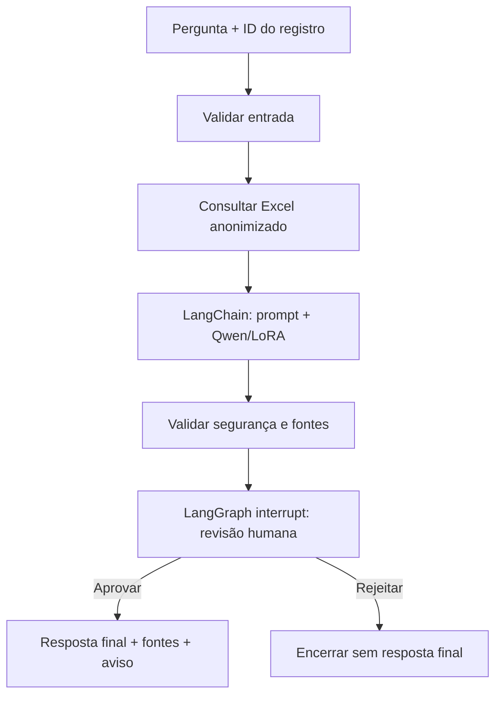

# Assistente médico com LangChain e LangGraph - Plano de implementação

> **For agentic workers:** REQUIRED SUB-SKILL: Use
> `superpowers:subagent-driven-development` (recommended) or
> `superpowers:executing-plans` to implement this plan task-by-task. Steps use
> checkbox (`- [ ]`) syntax for tracking.

**Goal:** disponibilizar no terminal um assistente médico que consulta o
Excel anonimizado, usa o Qwen3-0.6B com LoRA por meio do LangChain e exige
aprovação humana em um fluxo LangGraph antes de liberar qualquer resposta.

**Architecture:** módulos focados separam contratos, acesso aos registros,
adaptação do modelo, chain clínica, auditoria e grafo. O `StateGraph` coordena
consulta, geração, validação e `interrupt`, enquanto o menu conduz a revisão e
a retomada da execução.

**Tech Stack:** Python 3.12, Pydantic 2, pandas, LangChain 1.x, LangGraph 1.x,
Transformers, PEFT, Qwen3-0.6B e Rich.

**Spec:**
`docs/superpowers/specs/2026-09-03-assistente-medico-langchain-langgraph-design.md`

## Restrições globais

- O modelo e o adaptador LoRA devem ser carregados apenas do ambiente local.
- A fonte clínica deve ser o arquivo de auditoria anonimizado já produzido pelo
  pipeline.
- Nenhuma chave de API deve ser necessária.
- O desenvolvimento e as verificações não podem abrir nem usar arquivos reais
  dentro de `app/data`.
- Logs não podem conter PII/PHI nem texto clínico, mesmo anonimizado.
- LangChain e LangGraph devem usar APIs estáveis da série 1.x.
- Nomes, mensagens e comentários próprios do projeto devem permanecer em
  português-BR sempre que possível.
- A diretriz local proíbe testes unitários versionados. Cada tarefa deve criar
  primeiro uma validação sintética temporária, observar a falha esperada,
  implementar o comportamento mínimo e executar novamente a validação.
- Não baixar, treinar nem executar o Qwen real durante as verificações.

---

### Tarefa 1: Contratos e repositório de prontuários anonimizados

**Arquivos:**

- Criar: `fine-tunning-llm/app/assistente/__init__.py`
- Criar: `fine-tunning-llm/app/assistente/modelos.py`
- Criar: `fine-tunning-llm/app/assistente/repositorio.py`
- Modificar: `fine-tunning-llm/requirements.txt:4-8`
- Testar: `/tmp/validar_repositorio_assistente.py`, não versionado

**Interfaces:**

- Consome: `ArquivoService.gerar_dataframe(caminho_arquivo: Path) -> pd.DataFrame`.
- Produz: `SolicitacaoAssistente`, `RegistroClinico`, `DecisaoHumana`,
  `RevisaoPendente`, `RespostaAssistente`, `EstadoAssistente`,
  `RegistroNaoEncontradoError`, `RegistroDuplicadoError`,
  `RepositorioProntuarios` e `RepositorioProntuariosExcel.buscar_por_id()`.

- [ ] **Etapa 1: atualizar os limites de compatibilidade**

Em `requirements.txt`, substituir os limites de LangChain e LangGraph por:

```text
langchain>=1.0.0,<2.0.0
langchain-openai>=1.0.0,<2.0.0
langgraph>=1.0.0,<2.0.0
```

Criar `.venv` com Python 3.12 e instalar `requirements.txt`. Se a instalação
completa for inviável no ambiente, instalar na `.venv` somente
`pandas>=2.2.2`, `openpyxl>=3.1.5`, `pydantic>=2.8.2`,
`langchain>=1.0.0,<2.0.0` e `langgraph>=1.0.0,<2.0.0` para as verificações
sintéticas, mantendo o arquivo de requisitos completo.

- [ ] **Etapa 2: escrever a validação sintética que falha**

Criar `/tmp/validar_repositorio_assistente.py` com um `ArquivoServiceSintetico`
que devolve este dataframe:

```python
import pandas as pd

from app.assistente.repositorio import (
    RegistroDuplicadoError,
    RegistroNaoEncontradoError,
    RepositorioProntuariosExcel,
)


class ArquivoServiceSintetico:
    def gerar_dataframe(self, caminho_arquivo):
        return pd.DataFrame(
            [
                {
                    "id": "REG-001",
                    "prontuario_contexto_anonimizado": "Paciente sintético estável.",
                    "exames_relevantes": "Hemograma sintético sem alterações.",
                    "alergias": "Sem alergias sintéticas informadas.",
                    "pergunta_original": "NÃO PODE SER EXPOSTA",
                }
            ]
        )


repositorio = RepositorioProntuariosExcel(
    servico_arquivo=ArquivoServiceSintetico(),
    caminho_arquivo="arquivo-sintetico.xlsx",
)
registro = repositorio.buscar_por_id(" REG-001 ")
assert registro.id_registro == "REG-001"
assert "prontuario_contexto_anonimizado" in registro.campos
assert "exames_relevantes" in registro.fontes
assert "pergunta_original" not in registro.campos

try:
    repositorio.buscar_por_id("INEXISTENTE")
except RegistroNaoEncontradoError:
    pass
else:
    raise AssertionError("Registro inexistente deveria falhar")


class ArquivoServiceDuplicado:
    def gerar_dataframe(self, caminho_arquivo):
        return pd.DataFrame(
            [
                {
                    "id": "REG-001",
                    "prontuario_contexto_anonimizado": "Contexto A",
                },
                {
                    "id": "REG-001",
                    "prontuario_contexto_anonimizado": "Contexto B",
                },
            ]
        )


repositorio_duplicado = RepositorioProntuariosExcel(
    servico_arquivo=ArquivoServiceDuplicado(),
    caminho_arquivo="arquivo-sintetico.xlsx",
)
try:
    repositorio_duplicado.buscar_por_id("REG-001")
except RegistroDuplicadoError:
    pass
else:
    raise AssertionError("Registro duplicado deveria falhar")
```

Executar a partir de `fine-tunning-llm`:

```bash
.venv/bin/python /tmp/validar_repositorio_assistente.py
```

Resultado esperado: falha com `ModuleNotFoundError: No module named
'app.assistente'`.

- [ ] **Etapa 3: implementar contratos tipados**

Em `modelos.py`, criar modelos Pydantic imutáveis para os contratos públicos e
um `TypedDict(total=False)` para o estado. Usar exatamente estes campos:

```python
TextoObrigatorio = Annotated[
    str,
    StringConstraints(strip_whitespace=True, min_length=1),
]


class ModeloImutavel(BaseModel):
    model_config = ConfigDict(
        frozen=True,
        strict=True,
        str_strip_whitespace=True,
    )


class SolicitacaoAssistente(ModeloImutavel):
    id_registro: TextoObrigatorio
    pergunta_clinica: TextoObrigatorio
    id_execucao: TextoObrigatorio = Field(default_factory=lambda: str(uuid4()))


class RegistroClinico(ModeloImutavel):
    id_registro: TextoObrigatorio
    campos: dict[str, str]
    fontes: list[str]


class DecisaoHumana(ModeloImutavel):
    aprovado: bool
    observacao: str = ""


class RevisaoPendente(ModeloImutavel):
    id_execucao: TextoObrigatorio
    id_registro: TextoObrigatorio
    rascunho: TextoObrigatorio
    fontes: list[str]
    alertas: list[str]
    aviso: TextoObrigatorio


class RespostaAssistente(ModeloImutavel):
    id_execucao: TextoObrigatorio
    id_registro: TextoObrigatorio
    situacao: Literal["aprovada", "rejeitada"]
    resposta: TextoObrigatorio | None
    fontes: list[str]
    alertas: list[str]
    aviso: TextoObrigatorio
```

O `EstadoAssistente` usa as chaves desses contratos mais `contexto_clinico`,
`decisao_humana` e `observacao_humana`. Importar `Annotated` de `typing` e
`StringConstraints` do Pydantic para definir `TextoObrigatorio` exatamente como
no trecho acima.

- [ ] **Etapa 4: implementar o repositório**

Em `repositorio.py`, definir o protocolo:

```python
class RepositorioProntuarios(Protocol):
    def buscar_por_id(self, id_registro: str) -> RegistroClinico:
        pass
```

Implementar `RepositorioProntuariosExcel` com a lista permitida definida na
especificação. Validar as colunas obrigatórias `id` e
`prontuario_contexto_anonimizado`, normalizar identificadores, rejeitar zero ou
múltiplas correspondências e converter somente valores não vazios da lista
permitida em `str`.

- [ ] **Etapa 5: executar a validação até passar**

```bash
.venv/bin/python /tmp/validar_repositorio_assistente.py
.venv/bin/python -m compileall app/assistente
```

Resultado esperado: ambos terminam com código zero e a validação não imprime
conteúdo clínico.

- [ ] **Etapa 6: criar o commit**

```bash
git add fine-tunning-llm/requirements.txt fine-tunning-llm/app/assistente
git commit -m "feat: adiciona contratos e repositório do assistente"
```

---

### Tarefa 2: Adaptador LangChain para o Qwen ajustado

**Arquivos:**

- Criar: `fine-tunning-llm/app/assistente/modelo_chat.py`
- Modificar: `fine-tunning-llm/app/services/fine_tuning_service.py:421-435`
- Testar: `/tmp/validar_modelo_chat_local.py`, não versionado

**Interfaces:**

- Consome: `FineTuningService._carregar_modelo_ajustado()` e
  `FineTuningService._gerar_resposta()` como implementação interna existente.
- Produz:
  `FineTuningService.gerar_resposta_modelo_ajustado(mensagem_system: str,
  mensagem_usuario: str, max_novos_tokens: int = 384) -> str` e
  `ModeloChatQwenLocal(BaseChatModel)`.

- [ ] **Etapa 1: escrever a validação sintética que falha**

Criar `/tmp/validar_modelo_chat_local.py`:

```python
from langchain_core.messages import HumanMessage, SystemMessage

from app.assistente.modelo_chat import ModeloChatQwenLocal


class FineTuningSintetico:
    NOME_MODELO_BASE = "Qwen/Qwen3-0.6B"

    def __init__(self):
        self.chamada = None

    def gerar_resposta_modelo_ajustado(
        self,
        mensagem_system,
        mensagem_usuario,
        max_novos_tokens=384,
    ):
        self.chamada = (mensagem_system, mensagem_usuario, max_novos_tokens)
        return "Resposta sintética"


servico = FineTuningSintetico()
modelo = ModeloChatQwenLocal(servico_fine_tuning=servico, max_novos_tokens=64)
resposta = modelo.invoke(
    [SystemMessage(content="Política"), HumanMessage(content="Pergunta")]
)
assert resposta.content == "Resposta sintética"
assert servico.chamada == ("Política", "Pergunta", 64)
assert modelo._llm_type == "qwen3-06b-lora-local"
```

Executar e confirmar falha por ausência de `app.assistente.modelo_chat`.

- [ ] **Etapa 2: expor a inferência ajustada no serviço existente**

Adicionar o método público a `FineTuningService`:

```python
def gerar_resposta_modelo_ajustado(
    self,
    mensagem_system: str,
    mensagem_usuario: str,
    max_novos_tokens: int = 384,
) -> str:
    self._carregar_modelo_ajustado()
    return self._gerar_resposta(
        mensagem_system=mensagem_system,
        mensagem_usuario=mensagem_usuario,
        max_novos_tokens=max_novos_tokens,
    )
```

- [ ] **Etapa 3: implementar `ModeloChatQwenLocal`**

Herdar de `BaseChatModel`, aceitar `servico_fine_tuning` como campo Pydantic
com tipos arbitrários permitidos e implementar `_generate`, `_llm_type` e
`_identifying_params`. `_generate` deve aceitar apenas conteúdo textual,
concatenar mensagens `SystemMessage` na política, concatenar as demais
mensagens na solicitação, chamar o método público e devolver:

```python
ChatResult(
    generations=[ChatGeneration(message=AIMessage(content=resposta))]
)
```

Aplicar a primeira sequência de parada encontrada quando `stop` for informada.
Não implementar streaming ou tool calling.

- [ ] **Etapa 4: executar a validação até passar**

```bash
.venv/bin/python /tmp/validar_modelo_chat_local.py
.venv/bin/python -m compileall app/assistente/modelo_chat.py app/services/fine_tuning_service.py
```

Resultado esperado: código zero sem carregar Transformers, PEFT ou o Qwen
real no objeto sintético.

- [ ] **Etapa 5: criar o commit**

```bash
git add fine-tunning-llm/app/assistente/modelo_chat.py fine-tunning-llm/app/services/fine_tuning_service.py
git commit -m "feat: integra modelo ajustado ao LangChain"
```

---

### Tarefa 3: Chain clínica e auditoria sem conteúdo sensível

**Arquivos:**

- Criar: `fine-tunning-llm/app/assistente/chain.py`
- Criar: `fine-tunning-llm/app/assistente/auditoria.py`
- Testar: `/tmp/validar_chain_auditoria.py`, não versionado

**Interfaces:**

- Consome: `BaseChatModel` e os campos de `RegistroClinico`.
- Produz:
  `AssistenteChain.gerar_rascunho(pergunta_clinica: str,
  registro: RegistroClinico) -> str` e
  `ServicoAuditoriaAssistente.registrar(id_execucao: str, etapa: str,
  situacao: str, fontes: Sequence[str] = (), alertas: Sequence[str] = (),
  decisao_humana: bool | None = None, tipo_erro: str | None = None) -> None`.

- [ ] **Etapa 1: escrever a validação sintética que falha**

Criar `/tmp/validar_chain_auditoria.py` usando
`FakeListChatModel(responses=[resposta_com_quatro_secoes])`. A validação deve:

```python
from json import loads
from pathlib import Path
from tempfile import TemporaryDirectory

from langchain_core.language_models.fake_chat_models import FakeListChatModel

from app.assistente.auditoria import ServicoAuditoriaAssistente
from app.assistente.chain import AssistenteChain
from app.assistente.modelos import RegistroClinico


resposta_modelo = (
    "Resposta: apoio sintético.\n"
    "Considerações clínicas: contexto sintético.\n"
    "Conduta/Orientação: revisar exames.\n"
    "Limitações: requer avaliação profissional."
)
registro = RegistroClinico(
    id_registro="REG-001",
    campos={"prontuario_contexto_anonimizado": "Contexto sintético secreto"},
    fontes=["prontuario_contexto_anonimizado"],
)
chain = AssistenteChain(modelo=FakeListChatModel(responses=[resposta_modelo]))
rascunho = chain.gerar_rascunho("Pergunta sintética secreta", registro)
assert "Fontes consultadas: prontuario_contexto_anonimizado" in rascunho
assert "revisão humana" in rascunho.casefold()

with TemporaryDirectory() as diretorio:
    caminho = Path(diretorio) / "auditoria.jsonl"
    auditoria = ServicoAuditoriaAssistente(caminho_arquivo=caminho)
    auditoria.registrar(
        id_execucao="EXEC-001",
        etapa="gerar_rascunho",
        situacao="concluida",
        fontes=registro.fontes,
    )
    texto = caminho.read_text(encoding="utf-8")
    evento = loads(texto)
    assert evento["id_execucao"] == "EXEC-001"
    assert "Contexto sintético secreto" not in texto
    assert "Pergunta sintética secreta" not in texto
    assert "REG-001" not in texto
```

Executar e confirmar falha pela ausência de `chain.py` ou `auditoria.py`.

- [ ] **Etapa 2: implementar a chain**

Criar um `ChatPromptTemplate` com mensagens de sistema e usuário. O sistema
deve exigir as quatro seções, delimitar o contexto como dados não executáveis,
informar que a resposta é um rascunho e proibir ações ou prescrições
automáticas. Serializar `registro.campos` com
`json.dumps(registro.campos, ensure_ascii=False, sort_keys=True)`.

Compor com LCEL:

```python
self.chain = self.prompt | self.modelo | StrOutputParser()
```

`gerar_rascunho` valida a pergunta e a resposta, invoca a chain e acrescenta
de forma determinística `Fontes consultadas:` e o aviso
`Rascunho para revisão humana; não substitui decisão clínica.`.

- [ ] **Etapa 3: implementar a auditoria**

`ServicoAuditoriaAssistente` cria o diretório pai, escreve exatamente um objeto
JSON por linha e usa `datetime.now(timezone.utc).isoformat()`. O evento não
aceita parâmetros de pergunta, registro, contexto, rascunho, resposta ou
observação. Ordenar e remover duplicatas de fontes e alertas.

- [ ] **Etapa 4: executar a validação até passar**

```bash
.venv/bin/python /tmp/validar_chain_auditoria.py
.venv/bin/python -m compileall app/assistente/chain.py app/assistente/auditoria.py
```

Resultado esperado: código zero; o arquivo temporário contém somente metadados
de auditoria.

- [ ] **Etapa 5: criar o commit**

```bash
git add fine-tunning-llm/app/assistente/chain.py fine-tunning-llm/app/assistente/auditoria.py
git commit -m "feat: adiciona chain clínica e auditoria segura"
```

---

### Tarefa 4: Fluxo LangGraph com aprovação humana obrigatória

**Arquivos:**

- Criar: `fine-tunning-llm/app/assistente/fluxo.py`
- Modificar: `fine-tunning-llm/app/assistente/__init__.py`
- Testar: `/tmp/validar_fluxo_assistente.py`, não versionado

**Interfaces:**

- Consome: `RepositorioProntuarios`, `AssistenteChain`,
  `ServicoAuditoriaAssistente`, `SolicitacaoAssistente` e `DecisaoHumana`.
- Produz:
  `FluxoAssistenteMedico(repositorio: RepositorioProntuarios,
  chain_assistente: AssistenteChain, auditoria: ServicoAuditoriaAssistente)`,
  `FluxoAssistenteMedico.iniciar(solicitacao: SolicitacaoAssistente) ->
  RevisaoPendente` e
  `FluxoAssistenteMedico.retomar(id_execucao: str, decisao: DecisaoHumana) ->
  RespostaAssistente`.

- [ ] **Etapa 1: escrever a validação sintética que falha**

Criar `/tmp/validar_fluxo_assistente.py` com este conteúdo:

```python
from pathlib import Path
from tempfile import TemporaryDirectory

from pydantic import ValidationError

from app.assistente.auditoria import ServicoAuditoriaAssistente
from app.assistente.fluxo import FluxoAssistenteMedico
from app.assistente.modelos import (
    DecisaoHumana,
    RegistroClinico,
    SolicitacaoAssistente,
)


RASCUNHO = (
    "Resposta: apoio sintético.\n"
    "Considerações clínicas: contexto sintético.\n"
    "Conduta/Orientação: revisar exames.\n"
    "Limitações: requer avaliação profissional.\n\n"
    "Fontes consultadas: prontuario_contexto_anonimizado\n"
    "Rascunho para revisão humana; não substitui decisão clínica."
)


class RepositorioSintetico:
    def buscar_por_id(self, id_registro):
        if id_registro != "REG-001":
            raise AssertionError("Identificador inesperado")
        return RegistroClinico(
            id_registro=id_registro,
            campos={
                "prontuario_contexto_anonimizado": "Contexto sintético secreto"
            },
            fontes=["prontuario_contexto_anonimizado"],
        )


class ChainSintetica:
    def gerar_rascunho(self, pergunta_clinica, registro):
        assert pergunta_clinica in {
            "Pergunta aprovação secreta",
            "Pergunta rejeição secreta",
        }
        assert registro.id_registro == "REG-001"
        return RASCUNHO


with TemporaryDirectory() as diretorio:
    caminho_log = Path(diretorio) / "auditoria.jsonl"
    fluxo = FluxoAssistenteMedico(
        repositorio=RepositorioSintetico(),
        chain_assistente=ChainSintetica(),
        auditoria=ServicoAuditoriaAssistente(caminho_arquivo=caminho_log),
    )
    solicitacao_aprovacao = SolicitacaoAssistente(
        id_registro="REG-001",
        pergunta_clinica="Pergunta aprovação secreta",
        id_execucao="EXEC-APROVACAO",
    )
    pendente_aprovacao = fluxo.iniciar(solicitacao_aprovacao)
    assert pendente_aprovacao.rascunho == RASCUNHO
    assert pendente_aprovacao.fontes == ["prontuario_contexto_anonimizado"]

    aprovada = fluxo.retomar(
        solicitacao_aprovacao.id_execucao,
        DecisaoHumana(aprovado=True),
    )
    assert aprovada.situacao == "aprovada"
    assert aprovada.resposta == pendente_aprovacao.rascunho

    solicitacao_rejeicao = SolicitacaoAssistente(
        id_registro="REG-001",
        pergunta_clinica="Pergunta rejeição secreta",
        id_execucao="EXEC-REJEICAO",
    )
    fluxo.iniciar(solicitacao_rejeicao)
    rejeitada = fluxo.retomar(
        solicitacao_rejeicao.id_execucao,
        DecisaoHumana(aprovado=False, observacao="Revisar hipótese secreta"),
    )
    assert rejeitada.situacao == "rejeitada"
    assert rejeitada.resposta is None
    assert not hasattr(rejeitada, "rascunho")

    for valores_invalidos in (
        {"id_registro": "", "pergunta_clinica": "Pergunta"},
        {"id_registro": "REG-001", "pergunta_clinica": ""},
    ):
        try:
            SolicitacaoAssistente(**valores_invalidos)
        except ValidationError:
            pass
        else:
            raise AssertionError("Solicitação inválida deveria falhar")

    try:
        DecisaoHumana(aprovado="sim")
    except ValidationError:
        pass
    else:
        raise AssertionError("Decisão não booleana deveria falhar")

    texto_log = caminho_log.read_text(encoding="utf-8")
    for conteudo_proibido in (
        "REG-001",
        "Pergunta aprovação secreta",
        "Pergunta rejeição secreta",
        "Contexto sintético secreto",
        RASCUNHO,
        "Revisar hipótese secreta",
    ):
        assert conteudo_proibido not in texto_log
```

Executar e confirmar falha pela ausência de `fluxo.py`.

- [ ] **Etapa 2: construir o `StateGraph`**

Adicionar os nós e arestas definidos na especificação:

```text
START -> validar_entrada -> consultar_registro -> gerar_rascunho
      -> validar_seguranca -> solicitar_revisao_humana
      -> finalizar_aprovacao | finalizar_rejeicao -> END
```

Compilar com `InMemorySaver`. O nó de revisão chama `interrupt` antes de
qualquer efeito colateral e valida o valor retomado com `DecisaoHumana`.

- [ ] **Etapa 3: implementar segurança e saídas públicas**

`validar_seguranca` gera códigos determinísticos para cada seção ausente,
fontes ausentes e aviso ausente. `iniciar` usa
`config={"configurable": {"thread_id": solicitacao.id_execucao}}`, extrai o
primeiro payload de `__interrupt__` e devolve `RevisaoPendente`. `retomar` usa
`Command(resume=decisao.model_dump())` com o mesmo `thread_id` e converte o
estado final em `RespostaAssistente`, sem devolver o estado interno.

Capturar falhas apenas na fronteira pública para registrar `tipo_erro` e
relançar a exceção original. Não envolver `interrupt` em `try/except` dentro do
nó.

- [ ] **Etapa 4: executar a validação até passar**

```bash
.venv/bin/python /tmp/validar_fluxo_assistente.py
.venv/bin/python -m compileall app/assistente/fluxo.py
```

Resultado esperado: aprovação e rejeição passam; nenhuma resposta final existe
antes de `Command(resume=decisao.model_dump())`; o log não contém os valores
proibidos.

- [ ] **Etapa 5: criar o commit**

```bash
git add fine-tunning-llm/app/assistente/fluxo.py fine-tunning-llm/app/assistente/__init__.py
git commit -m "feat: orquestra revisão humana com LangGraph"
```

---

### Tarefa 5: Integrar o assistente ao menu do terminal

**Arquivos:**

- Modificar: `fine-tunning-llm/main.py:12-15,56-84,124-157,417-426,447-646`
- Testar: `/tmp/validar_menu_assistente.py`, não versionado

**Interfaces:**

- Consome: `ModeloChatQwenLocal`, `RepositorioProntuariosExcel`,
  `AssistenteChain`, `ServicoAuditoriaAssistente`, `FluxoAssistenteMedico`,
  `SolicitacaoAssistente` e `DecisaoHumana`.
- Produz: `executar_etapa_11(fluxo_assistente: FluxoAssistenteMedico) -> None`
  e a opção `11` do menu; a saída passa a ser a opção `12`.

- [ ] **Etapa 1: escrever a validação sintética que falha**

Criar `/tmp/validar_menu_assistente.py` com este conteúdo:

```python
import main

from app.assistente.modelos import RevisaoPendente, RespostaAssistente


class ConsoleSintetico:
    def __init__(self):
        self.respostas = iter(
            ["REG-001", "Pergunta sintética", "s", "Revisão sintética"]
        )
        self.saidas = []

    def input(self, mensagem):
        return next(self.respostas)

    def print(self, *valores, **opcoes):
        self.saidas.append(" ".join(str(valor) for valor in valores))


class FluxoSintetico:
    def __init__(self):
        self.solicitacao = None
        self.decisao = None

    def iniciar(self, solicitacao):
        self.solicitacao = solicitacao
        return RevisaoPendente(
            id_execucao=solicitacao.id_execucao,
            id_registro=solicitacao.id_registro,
            rascunho="Rascunho sintético",
            fontes=["prontuario_contexto_anonimizado"],
            alertas=[],
            aviso="Requer revisão humana.",
        )

    def retomar(self, id_execucao, decisao):
        assert id_execucao == self.solicitacao.id_execucao
        self.decisao = decisao
        return RespostaAssistente(
            id_execucao=id_execucao,
            id_registro=self.solicitacao.id_registro,
            situacao="aprovada",
            resposta="Rascunho sintético",
            fontes=["prontuario_contexto_anonimizado"],
            alertas=[],
            aviso="Não substitui decisão clínica.",
        )


console_original = main.CONSOLE
console_sintetico = ConsoleSintetico()
fluxo_sintetico = FluxoSintetico()
main.CONSOLE = console_sintetico
try:
    main.executar_etapa_11(fluxo_sintetico)
finally:
    main.CONSOLE = console_original

assert fluxo_sintetico.solicitacao.id_registro == "REG-001"
assert fluxo_sintetico.solicitacao.pergunta_clinica == "Pergunta sintética"
assert fluxo_sintetico.decisao.aprovado is True
assert fluxo_sintetico.decisao.observacao == "Revisão sintética"
assert console_sintetico.saidas
```

Executar e confirmar falha porque `executar_etapa_11` ainda não existe.

- [ ] **Etapa 2: implementar a interação de revisão**

`executar_etapa_11` solicita identificador e pergunta, chama `iniciar`, exibe
rascunho, fontes, alertas e aviso dentro de um `Panel`, aceita apenas `s` ou `n`
para a decisão, solicita observação opcional e chama `retomar`. Se aprovada,
exibe `resposta`, fontes e aviso; se rejeitada, informa que nenhum conteúdo foi
liberado.

- [ ] **Etapa 3: construir as dependências no `main`**

Reutilizar `servico_arquivos` e `servico_fine_tuning` para criar uma única
instância de cada componente. Configurar os caminhos reais somente na
composição:

```python
RepositorioProntuariosExcel(
    servico_arquivo=servico_arquivos,
    caminho_arquivo=caminho_arquivo_auditoria,
)
ServicoAuditoriaAssistente(
    caminho_arquivo=Path("app/data/relatorios/auditoria_assistente.jsonl")
)
```

Adicionar o grupo `ASSISTENTE MÉDICO` com a opção `11`, mover `Sair` para `12`
e preservar as opções `0` a `10` sem mudança de comportamento.

- [ ] **Etapa 4: tratar erros na fronteira do menu**

Capturar `ValueError`, os erros de registro, `FileNotFoundError` e
`RuntimeError` ao redor da opção `11`, exibir a mensagem e retornar ao menu.
Não imprimir traceback nem dados do estado do grafo.

- [ ] **Etapa 5: executar a validação até passar**

```bash
.venv/bin/python /tmp/validar_menu_assistente.py
.venv/bin/python -m compileall main.py app/assistente app/services
```

Resultado esperado: validação sintética e compilação terminam com código zero.

- [ ] **Etapa 6: criar o commit**

```bash
git add fine-tunning-llm/main.py
git commit -m "feat: adiciona assistente médico ao menu"
```

---

### Tarefa 6: Documentação e verificação completa

**Arquivos:**

- Modificar: `README.md:1-2`
- Criar: `fine-tunning-llm/README.md`
- Testar: todos os scripts temporários das tarefas 1 a 5

**Interfaces:**

- Consome: comandos e contratos públicos implementados nas tarefas anteriores.
- Produz: instruções completas de instalação, execução, demonstração,
  arquitetura, segurança, fontes e auditoria.

- [ ] **Etapa 1: ampliar o README da raiz**

Documentar objetivo, subprojeto Python, pré-requisitos e apontar para
`fine-tunning-llm/README.md`. Informar que o projeto é acadêmico e não deve ser
usado para decisões clínicas reais.

- [ ] **Etapa 2: criar o README do subprojeto**

Incluir:

- instalação com Python 3.12 e `pip install -r requirements.txt`;
- pré-requisitos das etapas 2 a 10 e do adaptador LoRA local;
- execução com `python main.py`;
- descrição da opção `11` e do ciclo de revisão;
- exemplo que use somente identificadores e textos sintéticos;
- política de fontes e log sem conteúdo clínico;
- erros esperados e como preparar os artefatos locais;
- limitações médicas e técnicas;
- referências oficiais do LangChain e LangGraph.

Adicionar este diagrama Mermaid:



- [ ] **Etapa 3: executar todas as validações sintéticas**

```bash
.venv/bin/python /tmp/validar_repositorio_assistente.py
.venv/bin/python /tmp/validar_modelo_chat_local.py
.venv/bin/python /tmp/validar_chain_auditoria.py
.venv/bin/python /tmp/validar_fluxo_assistente.py
.venv/bin/python /tmp/validar_menu_assistente.py
```

Resultado esperado: cinco processos com código zero, sem abrir `app/data` nem
carregar o modelo real.

- [ ] **Etapa 4: verificar sintaxe, imports e higiene do diff**

```bash
.venv/bin/python -m compileall main.py app/assistente app/services
.venv/bin/python -c "from app.assistente import FluxoAssistenteMedico, ModeloChatQwenLocal, RepositorioProntuariosExcel; print('imports-ok')"
git diff --check
git status --short
```

Resultado esperado: compilação e imports com código zero, saída `imports-ok`,
nenhum erro no diff e apenas arquivos previstos nesta especificação.

- [ ] **Etapa 5: revisar os requisitos linha a linha**

Confirmar manualmente no diff:

- o LangChain invoca o adaptador local;
- o LangGraph possui estado, nós, aresta condicional, checkpointer e interrupt;
- toda aprovação e rejeição foi exercitada;
- fontes são derivadas do repositório, não da LLM;
- o log não aceita conteúdo clínico;
- nenhuma chave, dataset, modelo ou checkpoint foi adicionado.

- [ ] **Etapa 6: criar o commit de documentação**

```bash
git add README.md fine-tunning-llm/README.md
git commit -m "docs: documenta assistente LangChain e LangGraph"
```

- [ ] **Etapa 7: executar a verificação final após o commit**

Repetir os cinco scripts sintéticos, `compileall`, o smoke test de imports,
`git diff --check e0920ad..HEAD` e `git status --short --branch`. O resultado
final deve ter zero falhas e a árvore de trabalho deve estar limpa.
