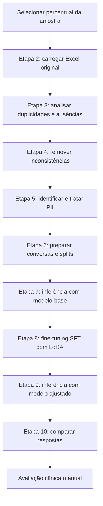
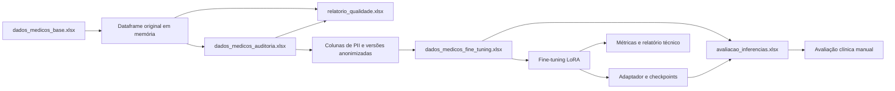

# Fluxo do Pipeline de Fine-Tuning

## Objetivo

Este documento descreve a sequência implementada pelo sistema desde a leitura do arquivo Excel original até a comparação final entre o modelo-base e o modelo ajustado por fine-tuning.

A descrição foi elaborada a partir do código-fonte atual de `main.py`, `analisar_tokens.py` e dos serviços em `app/services`. Nenhum arquivo dentro de `app/data` foi aberto ou inspecionado.

## Visão geral



O menu oferece dois atalhos principais:

- Opção **0 — Preparar dados**: executa as etapas 2 a 6.
- Opção **1 — Treinar e avaliar**: executa as etapas 7 a 10.

As etapas também podem ser executadas individualmente. A opção 11 encerra a aplicação.

## Componentes envolvidos

| Componente | Responsabilidade |
|---|---|
| `main.py` | Interface de console com Rich, controle do estado da sessão e orquestração das etapas 2 a 10. |
| `ArquivoService` | Leitura, amostragem, criação de TXT e gravação atômica de arquivos Excel com uma ou várias abas. |
| `QualidadeService` | Identificação e remoção de registros duplicados ou incompletos e geração do relatório consolidado de qualidade. |
| `PiiService` | Identificação de PII com Presidio e anonimização dos campos textuais tratados. |
| `FineTuningService` | Preparação do dataset, tokenização, splits, inferências, treinamento LoRA, métricas e comparação. |
| `analisar_tokens.py` | Diagnóstico auxiliar e manual da distribuição de tokens dos datasets preparados. |

## Pré-requisitos

Antes da execução completa, o ambiente precisa conter:

- dependências instaladas a partir de `requirements.txt`;
- modelo spaCy `pt_core_news_sm`, utilizado pelo Presidio;
- modelo `Qwen/Qwen3-0.6B` disponível no cache local do Hugging Face;
- arquivo Excel original no caminho esperado pelo sistema.

O modelo pode ser colocado no cache local com:

```text
hf download Qwen/Qwen3-0.6B
```

O código não baixa o modelo automaticamente. Tokenizer e pesos são carregados com `local_files_only=True`.

## Estado mantido pelo menu

Durante uma execução de `main.py`, o sistema mantém em memória:

- percentual de registros selecionado;
- dataframe original carregado;
- dataframe de auditoria tratado;
- indicação de que o arquivo de fine-tuning foi preparado;
- instâncias dos serviços de PII e fine-tuning, criadas somente quando necessárias.

Ao executar novamente a etapa 2, o dataframe de auditoria em memória é descartado e a preparação de fine-tuning volta ao estado pendente.

## Sequência detalhada

### Configuração inicial — percentual da amostra

Antes de exibir o menu, o sistema solicita o percentual de registros que será utilizado.

**Regras:**

- o valor deve ser numérico;
- deve ser maior que 0 e menor ou igual a 100;
- vírgula ou ponto podem ser usados como separador decimal na entrada do console;
- a quantidade é calculada com arredondamento para cima;
- a seleção preserva a ordem original e utiliza as primeiras linhas do dataframe;
- a etapa 2 solicita no mínimo três registros, limitado à quantidade realmente existente no Excel.

O mínimo de três registros é necessário para que treino, validação e teste recebam pelo menos um exemplo. Se o arquivo ou o conjunto elegível tiver menos de três registros, a preparação ou validação do dataset será interrompida.

---

### Etapa 2 — Leitura do arquivo Excel

**Responsáveis:** `main.executar_etapa_2` e `ArquivoService.gerar_dataframe`.

**Entrada:**

- `app/data/original/dados_medicos_base.xlsx`;
- percentual definido no início da execução.

**Processamento:**

1. Verifica se o arquivo existe.
2. Lê o Excel com pandas.
3. Calcula a quantidade correspondente ao percentual informado.
4. Garante, quando possível, o mínimo de três registros.
5. Seleciona as primeiras linhas, preservando a ordem do arquivo.

**Saída:**

- dataframe original mantido em memória;
- resumo no console com quantidade de linhas e colunas.

**Falhas que interrompem a etapa:**

- arquivo original inexistente;
- percentual inválido;
- erro de leitura do Excel.

O arquivo original não é alterado.

---

### Etapa 3 — Verificação de qualidade

**Responsáveis:** `main.executar_etapa_3` e `QualidadeService`.

**Pré-requisito:** etapa 2 executada na sessão atual.

**Processamento de duplicidades:**

- identifica linhas totalmente duplicadas com `DataFrame.duplicated(keep=False)`;
- registra os números das linhas considerando o cabeçalho do Excel;
- informa explicitamente quando não há duplicidades.

**Processamento de ausências:**

- considera ausentes valores nulos ou textos vazios após remoção de espaços;
- informa quando uma coluna monitorada não existe no dataset;
- monitora as colunas:
  - `papel_solicitante`;
  - `contexto_solicitacao`;
  - `pergunta_original`;
  - `prontuario_contexto`;
  - `resposta_estruturada`;
  - `hipotese_clinica`;
  - `especialidade_medica`;
  - `tipo_pergunta`;
  - `diagnostico_confirmado`.

**Saídas:**

- `app/data/relatorios/relatorio_qualidade.xlsx`.

Nesta etapa nada é removido. A aba `resumo` registra as quantidades encontradas e indica que o tratamento está pendente. A aba `ocorrencias` detalha o momento `Antes`, o tipo de inconsistência, a linha do Excel, o identificador do registro, a coluna e a descrição.

**Contrato das abas:**

- `resumo`: `tipo_inconsistencia`, `quantidade_antes`, `registros_removidos`, `quantidade_depois` e `resultado`;
- `ocorrencias`: `momento`, `tipo_inconsistencia`, `linha_excel`, `id_registro`, `coluna` e `descricao`.

Na etapa 3, `registros_removidos` e `quantidade_depois` permanecem vazios. O campo `resultado` recebe `Aguardando tratamento` quando há ocorrências ou `Sem ocorrências` quando não há nada a tratar.

---

### Etapa 4 — Tratamento das inconsistências

**Responsáveis:** `main.executar_etapa_4` e `QualidadeService`.

**Pré-requisito:** etapa 2 executada na sessão atual.

**Processamento:**

1. Remove registros totalmente duplicados.
2. Reorganiza o índice do dataframe.
3. Grava o resultado no arquivo de auditoria.
4. Remove registros com valor ausente em qualquer coluna monitorada.
5. Reorganiza novamente o índice.
6. Atualiza o arquivo de auditoria.
7. Consolida, em um único relatório, as ocorrências antes e depois e as quantidades de linhas removidas em cada tratamento.

**Saídas:**

- `app/data/processado/dados_medicos_auditoria.xlsx`;
- `app/data/relatorios/relatorio_qualidade.xlsx`, atualizado com o resumo e as ocorrências antes e depois do tratamento;
- dataframe de auditoria mantido em memória.

O relatório possui as abas `resumo` e `ocorrencias`. A primeira compara as quantidades antes e depois e informa quantos registros foram removidos. A segunda preserva o detalhamento das inconsistências encontradas nos dois momentos.

Após o tratamento, `resultado` pode ser `Tratado`, `Pendente` ou `Sem ocorrências`. As colunas `quantidade_antes` e `quantidade_depois` contam ocorrências, enquanto `registros_removidos` conta linhas excluídas. Por isso, os números podem ser diferentes: todas as cópias de uma duplicidade aparecem como ocorrências, embora uma seja preservada, e uma mesma linha pode possuir valores ausentes em várias colunas.

As gravações de Excel, inclusive as que possuem múltiplas abas, são atômicas: primeiro é produzido um arquivo temporário completo e, somente depois, ele substitui o destino. Isso reduz o risco de deixar um arquivo parcial em caso de falha durante a escrita.

**Observação:** se uma das colunas monitoradas estiver ausente, todos os registros são considerados incompletos para o tratamento dessa ausência.

---

### Etapa 5 — Identificação e tratamento de PII

**Responsáveis:** `main.executar_etapa_5` e `PiiService`.

**Pré-requisito:** dataframe de auditoria produzido pela etapa 4 na sessão atual.

#### Identificação

O Presidio utiliza o modelo spaCy `pt_core_news_sm` em português e um reconhecedor adicional de CPF. As entidades procuradas são:

- `PERSON`;
- `PHONE_NUMBER`;
- `DATE_TIME`;
- `CPF`.

A identificação percorre integralmente o dataframe já amostrado na etapa 2. Não existe uma segunda seleção percentual dentro do fluxo de PII.

A análise percorre as seguintes colunas configuradas em `main.py`:

- `papel_solicitante`;
- `contexto_solicitacao`;
- `pergunta_original`;
- `prontuario_contexto`;
- `resposta_estruturada`;
- `hipotese_clinica`;
- `especialidade_medica`;
- `tipo_pergunta`;
- `diagnostico_confirmado`;
- `exames_relevantes`;
- `medicamentos_utilizados`;
- `alergias`;
- `diagnosticos_anteriores`.

São adicionadas as colunas:

- `entidades identificadas`: tipos de entidade encontrados no registro, sem repetição;
- `possui_pii`: `Sim` ou `Não` para cada registro analisado.

#### Anonimização da pergunta

Em registros marcados com PII, `pergunta_original` é reanalisada e as entidades encontradas são substituídas por marcadores:

| Entidade | Marcador |
|---|---|
| Pessoa | `[nome do paciente]` |
| Telefone | `[Telefone do paciente]` |
| Data | `[Data de nascimento]` |
| CPF | `[cpf]` |

Quando há substituição, o resultado é salvo em `pergunta_original_anonimizado`. As linhas sem alteração preservam o valor original nessa coluna derivada.

#### Anonimização do prontuário

Para `prontuario_contexto`, o tratamento implementado:

- remove linhas identificadas pelos rótulos `Nome:` e `CPF:`;
- converte `Sexo:` para a frase `Paciente do Sexo ...`;
- mantém as demais linhas do prontuário;
- grava o resultado em `prontuario_contexto_anonimizado` quando ocorre alteração.

**Saída atualizada:**

- `app/data/processado/dados_medicos_auditoria.xlsx`;
- dataframe de auditoria anonimizado mantido em memória.

**Limite importante do fluxo atual:** a detecção verifica todas as colunas listadas, mas a anonimização integrada modifica especificamente `pergunta_original` e `prontuario_contexto`. Os campos `papel_solicitante`, `contexto_solicitacao` e `resposta_estruturada` também entram nas conversas de fine-tuning e precisam ser revisados quanto à presença de PII antes do uso de dados reais.

Além disso, a etapa 6 exige as duas colunas anonimizadas. Se nenhuma transformação criar uma delas, a preparação será interrompida por ausência de coluna obrigatória.

---

### Etapa 6 — Preparação do dataframe de fine-tuning

**Responsáveis:** `main.executar_etapa_6` e `FineTuningService.gerar_dataframe_fine_tuning`.

**Pré-requisito no menu:** etapas 2 a 5 executadas na sessão atual.

**Entrada:**

- `app/data/processado/dados_medicos_auditoria.xlsx`.

**Colunas obrigatórias da auditoria:**

- `id`;
- `papel_solicitante`;
- `contexto_solicitacao`;
- `pergunta_original_anonimizado`;
- `prontuario_contexto_anonimizado`;
- `resposta_estruturada`;
- `especialidade_medica`;
- `tipo_pergunta`.

**Construção da conversa:**

- `system`: instrução fixa de apoio clínico e de estrutura da resposta;
- `user`: combinação de papel do solicitante, contexto da solicitação, prontuário anonimizado e pergunta anonimizada;
- `assistant`: conteúdo de `resposta_estruturada`.

`especialidade_medica` e `tipo_pergunta` são preservadas como metadados no Excel preparado, mas não entram no `prompt` nem na `completion` usados atualmente pelo treinamento.

**Tokenização:**

- usa o tokenizer do `Qwen/Qwen3-0.6B` carregado do cache local;
- aplica o chat template completo com mensagens `system`, `user` e `assistant`;
- desativa o modo de raciocínio com `enable_thinking=False`;
- registra a contagem na coluna legada `total_okens_fine_tunning`.

**Divisão inicial:**

- 80% para `treino`;
- 10% para `validacao`;
- 10% para `teste`;
- embaralhamento reproduzível com seed 42;
- pelo menos um registro em cada split.

**Colunas geradas:**

- `id_exemplo`;
- `system`;
- `user`;
- `assistant`;
- `especialidade_medica`;
- `tipo_pergunta`;
- `total_okens_fine_tunning`;
- `split`.

**Saída:**

- `app/data/processado/dados_medicos_fine_tuning.xlsx`.

---

### Validação comum às etapas 7, 8, 9 e 10

Antes de treinar, inferir ou comparar, o arquivo preparado é carregado e validado.

O sistema verifica:

- existência das colunas usadas pelo dataset conversacional;
- ausência de valores vazios;
- identificadores não vazios e não repetidos;
- splits limitados a `treino`, `validacao` e `teste`;
- presença dos três splits;
- contagem de tokens inteira e não negativa;
- inexistência de conversas repetidas por `system`, `user` e `assistant`.

Depois da validação:

1. Mantém somente registros cuja contagem seja estritamente menor que 512 tokens.
2. Exige pelo menos três registros elegíveis.
3. Recalcula os splits sobre o conjunto elegível usando seed 42.

Esse recálculo garante que registros descartados pelo limite de tokens não deixem um split vazio. O arquivo preparado original não é substituído por essa versão filtrada; a seleção é refeita de forma reproduzível a cada carregamento.

Para o Hugging Face, cada exemplo é convertido em:

- `prompt`: mensagens `system` e `user`;
- `completion`: mensagem `assistant`;
- `id_exemplo`;
- `chat_template_kwargs` com `enable_thinking=False`.

---

### Etapa 7 — Inferência com o modelo-base

**Responsáveis:** `main.executar_etapa_7` e `FineTuningService.realizar_inferencia_base`.

**Entradas:**

- dataset de fine-tuning validado;
- modelo e tokenizer `Qwen/Qwen3-0.6B` no cache local.

**Processamento:**

1. Carrega tokenizer e modelo-base somente do cache local.
2. Configura o modelo em CPU, com `torch.float32` e modo de avaliação.
3. Seleciona registros do split `teste` em ordem estável por `id_exemplo`.
4. Usa, por padrão, os três primeiros registros de teste.
5. Aplica o chat template às mensagens `system` e `user`.
6. Trunca o lado esquerdo do prompt quando necessário, com limite de 512 tokens.
7. Gera até 384 novos tokens por resposta.
8. Usa geração determinística com `do_sample=False`.

**Saída:**

- `app/data/relatorios/avaliacao_inferencias.xlsx`.

Esta etapa inicia um novo ciclo e substitui o arquivo de avaliação anterior. O arquivo já é criado com todas as colunas da avaliação, incluindo identificador, split, mensagens, resposta esperada, `resposta_inferencia_base`, resposta ajustada e campos de avaliação manual. As colunas ainda não processadas permanecem vazias.

**Colunas do arquivo consolidado:**

- `id_exemplo`;
- `split`;
- `system`;
- `user`;
- `resposta_esperada`;
- `resposta_inferencia_base`;
- `resposta_inferencia_fine_tuning`;
- `avaliacao_estrutura`;
- `avaliacao_relevancia_clinica`;
- `avaliacao_alucinacao`;
- `avaliacao_exposicao_pii`;
- `observacoes`.

---

### Etapa 8 — Fine-tuning supervisionado com LoRA

**Responsáveis:** `main.executar_etapa_8` e `FineTuningService.realizar_fine_tuning`.

**Datasets utilizados:**

- `treino`: usado para atualização dos parâmetros LoRA;
- `validacao`: usado para avaliação antes e depois do treinamento e seleção do melhor checkpoint;
- `teste`: não participa do `SFTTrainer`.

**Configuração principal:**

| Parâmetro | Valor padrão |
|---|---:|
| Modelo-base | `Qwen/Qwen3-0.6B` |
| Dispositivo | CPU |
| Precisão | `torch.float32` |
| Épocas | 3 |
| Learning rate | `1e-4` |
| Lote de treino | 1 |
| Lote de validação | 1 |
| Acumulação de gradiente | 8 |
| Lote efetivo | 8 |
| Limite de sequência | 512 tokens |
| LoRA rank | 16 |
| LoRA alpha | 32 |
| LoRA dropout | 0,05 |
| Módulos LoRA | `q_proj`, `v_proj` |
| Seed | 42 |

O treinamento usa `completion_only_loss=True`, portanto a perda é calculada somente sobre a resposta `assistant` esperada.

**Sequência interna:**

1. Converte os splits em `DatasetDict`.
2. Carrega o modelo-base do cache local.
3. Calcula estatísticas agregadas de tokens, sem registrar conteúdo clínico.
4. Cria a configuração LoRA e a configuração do `SFTTrainer`.
5. Avalia o modelo com o adaptador ainda não treinado no split de validação.
6. Executa o treinamento.
7. Avalia novamente no mesmo split de validação.
8. Mantém o melhor modelo conforme `eval_loss`.
9. Salva adaptador, tokenizer, checkpoints, métricas e relatório técnico.

**Artefatos:**

- `app/modelos/qwen3_06b_lora/`: adaptador LoRA e tokenizer;
- `app/modelos/qwen3_06b_lora/checkpoints/`: até dois checkpoints;
- `app/data/relatorios/metricas_fine_tuning.txt`;
- `app/data/relatorios/relatorio_tecnico_fine_tuning.xlsx`.

O relatório técnico compara perda de validação, perplexidade e acurácia média de tokens antes e depois do fine-tuning. O veredito automático considera sucesso técnico quando a perda de validação cai pelo menos 5% sem queda da acurácia de tokens. Esse resultado não substitui avaliação clínica.

---

### Etapa 9 — Inferência com o modelo ajustado

**Responsáveis:** `main.executar_etapa_9` e `FineTuningService.realizar_inferencia_fine_tuning`.

**Pré-requisitos:**

- modelo-base disponível no cache local;
- `adapter_config.json` e demais arquivos do adaptador em `app/modelos/qwen3_06b_lora/`;
- dataset de fine-tuning validado.

**Processamento:**

1. Carrega novamente o modelo-base local.
2. Aplica o adaptador salvo com `PeftModel` em modo não treinável.
3. Usa os mesmos critérios de seleção do split de teste da etapa 7.
4. Usa as mesmas mensagens, truncamento, geração determinística e limite de 384 novos tokens.
5. Confirma que identificadores, split, mensagens e respostas esperadas coincidem com a inferência-base.
6. Atualiza `resposta_inferencia_fine_tuning` e limpa avaliações manuais antigas.

**Saída:**

- `app/data/relatorios/avaliacao_inferencias.xlsx` atualizado.

Se a etapa 9 for executada sem um arquivo anterior, ela cria o arquivo consolidado com a resposta-base vazia. Nesse caso, a etapa 10 exigirá a execução da etapa 7 e uma nova execução da etapa 9 para formar um ciclo completo e consistente.

---

### Etapa 10 — Comparação e teste final

**Responsáveis:** `main.executar_etapa_10` e `FineTuningService.comparar_inferencias`.

**Entradas:**

- dataset preparado e validado;
- `app/data/relatorios/avaliacao_inferencias.xlsx`.

**Validações antes da comparação:**

- o arquivo não pode estar vazio;
- colunas obrigatórias devem existir e estar preenchidas;
- identificadores devem ser válidos e únicos;
- todos os identificadores devem pertencer ao split `teste`;
- as respostas base e ajustada devem estar preenchidas;
- split, mensagens e resposta esperada devem coincidir com o dataset atual.

**Conteúdo da comparação:**

- resposta esperada;
- resposta do modelo-base;
- resposta do modelo ajustado;
- mensagens usadas na inferência;
- campos vazios para avaliação manual.

**Saída final:**

- `app/data/relatorios/avaliacao_inferencias.xlsx`, validado e pronto para avaliação humana.

Os campos destinados à avaliação humana são:

- `avaliacao_estrutura`;
- `avaliacao_relevancia_clinica`;
- `avaliacao_alucinacao`;
- `avaliacao_exposicao_pii`;
- `observacoes`.

## O que representa o teste final

O projeto possui duas formas complementares de avaliação:

1. **Avaliação técnica automática:** realizada na etapa 8 sobre o split de validação, comparando métricas antes e depois do LoRA.
2. **Avaliação comparativa e clínica:** preparada na etapa 10 sobre o split de teste, colocando lado a lado a resposta esperada, a resposta-base e a resposta ajustada.

O teste final somente termina após um avaliador preencher e revisar os critérios manuais de estrutura, relevância clínica, alucinação e exposição de PII. As métricas de tokens e perda não são suficientes para confirmar segurança ou correção clínica.

## Dependências entre as etapas

| Etapa | Depende de | Produz o necessário para |
|---|---|---|
| 2 | Excel original | 3 e 4 |
| 3 | Dataframe original em memória | Auditoria informativa |
| 4 | Dataframe original em memória | 5 e 6 |
| 5 | Dataframe tratado em memória | 6 |
| 6 | Arquivo de auditoria com colunas anonimizadas | 7, 8, 9 e 10 |
| 7 | Dataset preparado e modelo-base em cache | Arquivo consolidado e etapas 9 e 10 |
| 8 | Dataset preparado e modelo-base em cache | 9 e relatório técnico |
| 9 | Dataset preparado, modelo-base, adaptador LoRA e resultado compatível da etapa 7 | 10 |
| 10 | Dataset preparado e arquivo consolidado completo | Avaliação clínica manual |

## Mapa dos artefatos



| Artefato | Finalidade |
|---|---|
| `app/data/original/dados_medicos_base.xlsx` | Fonte original, somente leitura. |
| `app/data/relatorios/relatorio_qualidade.xlsx` | Resumo e ocorrências de duplicidades e ausências antes e depois do tratamento. |
| `app/data/processado/dados_medicos_auditoria.xlsx` | Dados tratados e enriquecidos com auditoria de PII. |
| `app/data/processado/dados_medicos_fine_tuning.xlsx` | Conversas, metadados, tokens e splits. |
| `app/modelos/qwen3_06b_lora/` | Adaptador LoRA, tokenizer e checkpoints locais. |
| `app/data/relatorios/metricas_fine_tuning.txt` | Configuração, métricas e estatísticas agregadas. |
| `app/data/relatorios/relatorio_tecnico_fine_tuning.xlsx` | Comparação técnica antes/depois e veredito automático. |
| `app/data/relatorios/avaliacao_inferencias.xlsx` | Resposta esperada, inferências base e ajustada e campos de avaliação manual. |

## Diagnóstico auxiliar de tokens

O script `analisar_tokens.py` não faz parte do menu. Ele:

- carrega os datasets preparados pelo `FineTuningService`;
- usa o tokenizer local do mesmo modelo-base;
- embaralha cada split com seed 42;
- analisa até 80 exemplos de treino, 10 de validação e 10 de teste;
- apresenta no console quantidade, média, mediana, percentil 95, máximo e proporção acima de 256 tokens.

Ele é um diagnóstico manual e não altera a sequência obrigatória das etapas. Como acessa o dataset preparado, não deve ser executado em tarefas do ChatGPT que proíbem inspeção de `app/data`.

## Critérios para considerar o pipeline concluído

O fluxo pode ser considerado executado até o fim quando:

- o arquivo original permanece inalterado;
- o relatório consolidado de qualidade foi produzido;
- o arquivo de auditoria contém o tratamento de inconsistências e PII;
- o dataset de fine-tuning possui exemplos válidos nos três splits;
- o modelo-base foi avaliado no split de teste;
- o adaptador LoRA, as métricas e o relatório técnico foram gerados;
- o modelo ajustado foi avaliado sobre os mesmos exemplos usados pelo modelo-base;
- o arquivo consolidado de avaliação foi validado sem divergência de identificadores ou mensagens;
- a revisão clínica e de privacidade das respostas foi realizada manualmente.

## Cuidados de segurança

- Não modificar o arquivo Excel original.
- Não versionar datasets, relatórios com conteúdo sensível, adaptadores, checkpoints ou modelos.
- Não publicar artefatos no Hugging Face sem revisão e autorização explícitas.
- Tratar o arquivo consolidado de avaliação como potencialmente sensível, pois ele reúne prompts e respostas completas.
- Confirmar que todos os campos enviados ao modelo estão livres de PII, não apenas aqueles atualmente anonimizados pelo fluxo automático.
