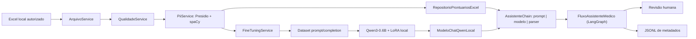
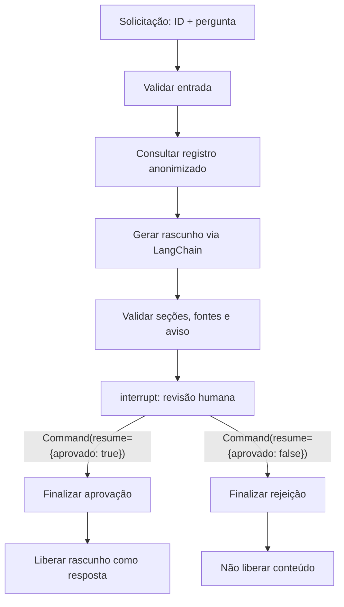

# Relatório técnico — pipeline local e assistente médico demonstrável

## Objetivo, escopo e limites

O projeto demonstra, para fins acadêmicos, um pipeline Python 3.12 que transforma registros tabulares locais em exemplos conversacionais anonimizados, faz SFT do `Qwen/Qwen3-0.6B` com LoRA em CPU e permite consultar contexto estruturado por um assistente sujeito a revisão humana obrigatória. Ele não pretende validar eficácia clínica, substituir protocolo institucional ou disponibilizar um produto de saúde.

> **Não usar em assistência real.** O sistema não diagnostica, prescreve, recomenda dose, executa conduta, atualiza prontuários nem toma decisão clínica. A saída é um rascunho probabilístico, possivelmente incompleto, incorreto, desatualizado ou alucinado. A pessoa revisora qualificada é responsável por avaliar fontes, alertas e conteúdo antes de qualquer uso.

Somente exemplos sintéticos devem aparecer em documentação, terminal, issues e apresentações. Não publique nem versione dados brutos/anonimizados, PHI/PII, modelos, adaptadores, checkpoints ou logs de execução. A árvore `app/data/` é local e não deve ser inspecionada durante tarefas automatizadas deste projeto.

## Matriz de rastreabilidade dos requisitos

| Requisito das páginas 2–4 do enunciado | Implementação/evidência | Como demonstrar |
| --- | --- | --- |
| Fine-tuning de LLM com dados internos (protocolos, perguntas e modelos de documentos) | `FineTuningService` prepara conversas e treina Qwen3-0.6B com LoRA; as fontes concretas dependem de dados institucionais autorizados | Executar opções 6–10 com artefatos locais autorizados; mostrar somente resultados sintéticos ou agregados. |
| Preprocessing, anonimização e curadoria | Opções 2–6; `QualidadeService`, `PiiService` e validações de colunas, IDs, duplicidade, splits e tokens | Mostrar relatórios agregados e tokens substituídos; revisar amostra local sem exibi-la. |
| Pipeline LangChain com LLM customizada | `ModeloChatQwenLocal` adapta a inferência Qwen/LoRA; `AssistenteChain` usa `ChatPromptTemplate` e LCEL | Opção 11, após LoRA local existir. |
| Consulta a base estruturada | `RepositorioProntuariosExcel` busca um ID único no Excel anonimizado e expõe allowlist de campos | Consultar um ID sintético em ambiente de demonstração. |
| Resposta contextualizada com dados atuais | O repositório recupera o registro no momento da pergunta; a chain serializa o contexto estruturado como dado não executável | Mostrar os campos-fonte, sem revelar conteúdo clínico real. |
| Limites contra sugestões impróprias e validação humana | Prompt restritivo, validação de seções, alertas, `interrupt` e aprovação explícita | Rejeitar um rascunho e confirmar que nada é liberado; depois aprovar um exemplo sintético. |
| Logging, auditoria e explainability | `ServicoAuditoriaAssistente` grava JSONL apenas com metadados; fontes são nomes de campos permitidos, não invenções da LLM | Mostrar uma linha de log sanitizada e as fontes no painel de revisão. |
| Código Python modular e README completo | Serviços separados em `app/services/`; assistente em `app/assistente/`; este relatório | Navegar pelos módulos e rodar as verificações desta documentação. |
| Fluxos LangGraph | `FluxoAssistenteMedico` implementa grafo, estado, nós, rota condicional e checkpointer | Exibir o fluxo abaixo e a pausa/reinício da opção 11. |
| Dataset anonimizado ou exemplos sintéticos | O pipeline produz dataset local anonimizado; este README fornece somente exemplos sintéticos | Incluir no repositório apenas exemplo sintético quando a política institucional permitir. |
| Relatório técnico, diagrama LangChain e avaliação | Seções “Fine-tuning”, “Avaliação” e diagramas Mermaid abaixo | Apresentar métricas geradas localmente, sem inventar resultados. |
| Vídeo de até 15 minutos | Roteiro nesta documentação | Gravar treinamento, fluxo, pergunta contextualizada e auditoria. |

PubMedQA e MedQuAD são sugestões do enunciado, não datasets incorporados ao repositório nem executados pelo código. Qualquer adoção exige licença, curadoria clínica, compatibilidade de idioma/uso e anonimização antes de entrar no pipeline.

## Arquitetura e estrutura



| Caminho | Responsabilidade |
| --- | --- |
| [`main.py`](main.py) | Menu Rich, orquestração das etapas e interação de revisão. |
| [`app/services/arquivo_service.py`](app/services/arquivo_service.py) | Leitura/escrita local de Excel e TXT. |
| [`app/services/qualidade_service.py`](app/services/qualidade_service.py) | Relatórios e tratamento de duplicidades/campos ausentes. |
| [`app/services/pii_service.py`](app/services/pii_service.py) | Detecção e anonimização de PII/PHI textual. |
| [`app/services/fine_tuning_service.py`](app/services/fine_tuning_service.py) | Dataset, SFT/LoRA, inferências, métricas e comparação. |
| [`app/assistente/repositorio.py`](app/assistente/repositorio.py) | Consulta controlada ao Excel anonimizado. |
| [`app/assistente/modelo_chat.py`](app/assistente/modelo_chat.py) | Adaptador `BaseChatModel` para a inferência local Qwen/LoRA. |
| [`app/assistente/chain.py`](app/assistente/chain.py) | Prompt, LCEL, parser, seções e aviso determinístico. |
| [`app/assistente/fluxo.py`](app/assistente/fluxo.py) | Orquestração LangGraph e bloqueio por revisão humana. |
| [`app/assistente/auditoria.py`](app/assistente/auditoria.py) | Eventos JSON Lines sanitizados. |

## Dados, qualidade, preprocessing, curadoria e privacidade

O arquivo de origem é lido localmente; as opções 3 e 4 identificam e removem registros duplicados e registros com campos monitorados ausentes, gerando relatórios antes/depois. A opção 5 examina as colunas textuais configuradas em `COLUNAS_ANALISADAS_PII` com Microsoft Presidio e `pt_core_news_sm` do spaCy. O reconhecedor adicional detecta CPF; as entidades monitoradas incluem `PERSON`, `PHONE_NUMBER`, `DATE_TIME` e `CPF`.

Quando necessário, a pergunta recebe substituições como `[nome do paciente]`, `[Telefone do paciente]`, `[Data de nascimento]` e `[cpf]`. O prontuário recebe tratamento específico: linhas de nome/CPF são removidas e o sexo é preservado em forma normalizada. A anonimização reduz risco, mas não comprova ausência de reidentificação: a curadoria humana deve revisar falsos positivos/negativos, minimização de campos, autorização, retenção, acesso e aderência às políticas institucionais/LGPD.

Antes de treinamento/inferência, o serviço exige colunas de origem, campos não vazios, IDs únicos, conversas não repetidas, splits válidos e ao menos três exemplos elegíveis. O total de tokens é medido com o mesmo chat template do Qwen; exemplos com total **menor que** o limite configurado de 512 tornam-se elegíveis. O sistema mantém contagem agregada de descartes e estatísticas por split, sem registrar conteúdo clínico no relatório de métricas.

## Dataset conversacional

A etapa 6 produz localmente um Excel de fine-tuning com `id_exemplo`, `system`, `user`, `assistant`, `total_okens_fine_tunning` e `split`, além de metadados de especialidade e tipo de pergunta. O nome da coluna de tokens reproduz exatamente o código atual. Cada linha corresponde a uma conversa:

```text
system: política fixa de apoio clínico e quatro seções obrigatórias
user: Papel do solicitante + Contexto da solicitação + Prontuário anonimizado + Pergunta anonimizada
assistant: resposta_estruturada de referência
```

Para o `SFTTrainer`, a conversa é convertida em `prompt` (mensagens `system` e `user`) e `completion` (mensagem `assistant`); a perda é calculada somente na completion. O split usa embaralhamento com seed 42 e alvo 80% treino / 10% validação / 10% teste. Em conjuntos pequenos, preserva-se pelo menos um item de validação e um de teste; por isso a proporção pode sofrer arredondamento. Depois do filtro de tokens, os splits são recalculados.

Exemplo exclusivamente sintético de esquema (não é dado do projeto):

```json
{
  "id_exemplo": "DEMO-0001",
  "system": "Você é um assistente de apoio clínico...",
  "user": "Papel do solicitante: Profissional fictício\nContexto da solicitação: demonstração\nProntuário: Paciente fictício sem identificadores\nPergunta: Quais pontos devem ser revisados?",
  "assistant": "Resposta: Rascunho sintético.\nConsiderações clínicas: Revisar contexto.\nConduta/Orientação: Submeter ao profissional.\nLimitações: Exemplo não clínico.",
  "split": "teste"
}
```

## Fine-tuning do Qwen3-0.6B

O carregamento é local (`local_files_only=True`), em CPU e `torch.float32`. Não há inferência remota nem envio de conteúdo a provedores externos. O tokenizer usa o chat template do modelo com `enable_thinking=False`; o prompt de entrada é truncado à esquerda e limitado a 512 tokens. A geração é determinística (`do_sample=False`) e produz, por padrão, até 384 tokens novos nas inferências do pipeline.

| Item | Configuração implementada |
| --- | --- |
| Modelo-base | `Qwen/Qwen3-0.6B` no cache Hugging Face local |
| Método | SFT com TRL e PEFT/LoRA para `CAUSAL_LM` |
| LoRA | `r=16`, `lora_alpha=32`, `lora_dropout=0.05`, `bias="none"`, módulos `q_proj` e `v_proj` |
| Treinamento | 3 épocas, `learning_rate=1e-4`, batch por dispositivo 1, acumulação 8, `adamw_torch` |
| Reprodutibilidade | `seed=42`, `data_seed=42`; resultados ainda dependem de versões, CPU e dados locais |
| Avaliação/checkpoints | `eval_strategy="epoch"`, `save_strategy="epoch"`, até 2 checkpoints, melhor modelo por `eval_loss` |
| Precisão/dispositivo | CPU, float32, sem fp16/bf16, sem gradient checkpointing |

### Comandos reproduzíveis

No diretório deste README:

```bash
python3.12 -m venv .venv
source .venv/bin/activate
python -m pip install -r requirements.txt
python -m spacy download pt_core_news_sm
hf download Qwen/Qwen3-0.6B
python main.py
```

No menu, execute a opção 0 para preparar dados (2–6), depois a opção 1 (7–10) ou as etapas individuais. O download apenas preenche o cache local; o código exige esse cache e falha de forma explícita se ele não estiver disponível. O treinamento em CPU pode ser lento e requer RAM/armazenamento compatíveis com o ambiente. Não use `huggingface-cli`, que está descontinuado; use `hf`.

Artefatos locais esperados após as execuções: dataset preparado, inferências base/ajustada, comparação, métricas TXT, relatório técnico XLSX, checkpoints e adaptador LoRA com tokenizer. Eles não são entregáveis versionados. `/tmp` pode ser usado apenas para verificações transitórias: não é versionado, não é caminho de artefato do projeto e não deve conter dados clínicos.

## Avaliação: base versus ajustado

A opção 7 gera a inferência-base no split `teste`; a 9 gera a inferência com o adaptador; a 10 exige os mesmos IDs e as mesmas mensagens e cria uma comparação lado a lado com a referência. Por padrão, as inferências limitam-se aos três primeiros registros ordenados do teste. A comparação inclui campos para avaliação manual de estrutura, relevância clínica, alucinação, exposição de PII e observações.

Não há métricas ou resultados pré-calculados neste repositório, e esta documentação não inventa números. Após uma execução autorizada, registre em relatório local: `eval_loss` antes/depois, perplexidade derivada quando calculável, `eval_mean_token_accuracy` quando fornecida pelo runtime, passos, parâmetros treináveis/totais, estatísticas agregadas de tokens e julgamento humano cego ou revisado por caso. A opção 8 grava métricas e um relatório técnico local; a opção 10 guarda o quadro de comparação. Avalie também aderência às quatro seções, fidelidade ao contexto/fonte, segurança de orientação, ausência de PII e limites de generalização. Métricas de treino não comprovam validade clínica.

## Assistente com LangChain e dados estruturados

`ModeloChatQwenLocal` implementa um adaptador de `BaseChatModel`: reúne mensagens de sistema e usuário e chama `FineTuningService.gerar_resposta_modelo_ajustado`, usando exclusivamente Qwen/LoRA local. `AssistenteChain` monta um `ChatPromptTemplate` e compõe LCEL (`prompt | modelo | StrOutputParser()`). O contexto é serializado em JSON como dado não executável; instruções contidas no contexto não devem ser seguidas.

`RepositorioProntuariosExcel` busca exatamente um ID e recusa ausência ou duplicidade. Ele expõe somente campos não vazios da allowlist: `prontuario_contexto_anonimizado`, hipótese clínica, diagnóstico confirmado, exames relevantes, medicamentos utilizados, alergias, diagnósticos anteriores e especialidade médica. As fontes exibidas são os **nomes dos campos efetivamente retornados**; não constituem evidência científica nem são geradas pela LLM.

O prompt exige as quatro seções abaixo. A chain valida sua presença e acrescenta de forma determinística fontes e o aviso de revisão humana:

1. `Resposta`
2. `Considerações clínicas`
3. `Conduta/Orientação`
4. `Limitações`

## LangGraph e decisão humana

O grafo usa `EstadoAssistente` serializável e os nós `validar_entrada`, `consultar_registro`, `gerar_rascunho`, `validar_seguranca`, `solicitar_revisao_humana`, `finalizar_aprovacao` e `finalizar_rejeicao`. Ele é compilado com `InMemorySaver`, portanto serve apenas à demonstração local: o estado interrompido não deve ser considerado persistente quando o processo termina.



Na opção 11, a execução interrompe após mostrar rascunho, fontes, alertas e aviso. A pessoa revisora informa `s` ou `n` e uma observação opcional. O fluxo é retomado com `Command(resume=...)`; apenas a rota aprovada copia o rascunho para a resposta pública. Alertas não são um selo de segurança: sempre exigem julgamento profissional.

## Segurança, auditoria e interface

- O prompt proíbe ações e prescrições automáticas; a validação detecta ausência de seções, fontes e aviso.
- O repositório usa allowlist, valida colunas obrigatórias e exige correspondência única de ID.
- A auditoria JSONL registra somente metadados: horário UTC, UUID de execução, etapa, situação, nomes de fontes, códigos de alerta, decisão humana e tipo de erro. Não aceita/grava ID de registro, pergunta, prontuário, rascunho, resposta ou observação.
- O payload de `interrupt` é destinado à sessão de revisão e não ao arquivo JSONL. `InMemorySaver` não é armazenamento clínico durável.
- A interface Rich apresenta tabelas/painéis, estados e mensagens de erro; não substitui controles de acesso, criptografia, gestão de segredos, revisão de LGPD ou governança institucional.

## Instalação e cache

Use Python 3.12. Mantenha o ambiente virtual, cache Hugging Face, modelos e artefatos de treinamento apenas na máquina/autorização adequada. Não há chave de API exigida pelo fluxo atual.

```bash
cd fine-tunning-llm
python3.12 -m venv .venv
source .venv/bin/activate
python -m pip install --upgrade pip
python -m pip install -r requirements.txt
python -m spacy download pt_core_news_sm
hf download Qwen/Qwen3-0.6B
```

As dependências incluem pandas/openpyxl/pyarrow para dados, Presidio e spaCy para PII, Transformers/Datasets/Accelerate/PEFT/TRL/Torch/Evaluate para o modelo, LangChain/LangGraph para orquestração e Rich para o terminal. O adaptador `langchain-openai` está declarado, mas o assistente descrito aqui não o chama nem requer API externa.

## Execução pelo menu (0–12)

| Opção | Ação | Dependência |
| --- | --- | --- |
| 0 | Executa preparação 2–6 | Arquivo local autorizado; encerra antes de treinamento. |
| 1 | Executa 7–10 | Dataset preparado, cache Qwen e, para 9–10, LoRA produzido na 8. |
| 2 | Lê Excel e gera dataframe | Arquivo de origem local. |
| 3 | Analisa repetidos e ausentes | Etapa 2 na mesma sessão. |
| 4 | Remove inconsistências e salva auditoria | Etapa 2 na mesma sessão. |
| 5 | Identifica/trata PII | Etapa 4 na mesma sessão e modelo spaCy instalado. |
| 6 | Prepara dataset conversacional | Etapas 2–5 na mesma sessão, cache Qwen para contar tokens. |
| 7 | Inferência-base | Dataset válido e cache Qwen. |
| 8 | SFT/LoRA | Dataset válido e cache Qwen; CPU/RAM/tempo suficientes. |
| 9 | Inferência ajustada | Dataset válido, cache Qwen e adaptador LoRA da 8. |
| 10 | Compara inferências | Relatórios das opções 7 e 9 para os mesmos exemplos de teste. |
| 11 | Consulta com revisão humana | Excel anonimizado compatível, cache Qwen e adaptador LoRA. |
| 12 | Sai do programa | Nenhuma. |

Fluxo recomendado: `0` → `1` → `11`. Para granularidade, use `2` → `3` → `4` → `5` → `6` na **mesma execução** do programa; depois `7` → `8` → `9` → `10`; por fim `11`. A opção 1 não prepara dados e a opção 0 não treina. Execute com:

```bash
python main.py
```

Exemplo de interação puramente sintética:

```text
Opção: 11
ID do registro: DEMO-0001
Pergunta clínica: Em um cenário fictício, quais pontos precisam de revisão profissional?
Decisão do revisor: s
Observação: Aprovação exclusivamente demonstrativa.
```

## Verificações reproduzíveis

Estes comandos não executam o pipeline nem leem artefatos clínicos. Rode-os a partir da raiz do repositório:

```bash
git diff --check
python3 -m compileall fine-tunning-llm/main.py fine-tunning-llm/app/services fine-tunning-llm/app/assistente
rg -n -e 'TO''DO' -e 'TB''D' -e 'XX''X' README.md fine-tunning-llm/README.md
git diff --name-only
```

A última saída deve conter apenas `README.md` e `fine-tunning-llm/README.md` para esta alteração. Se usar arquivos temporários em `/tmp`, trate-os como descartáveis e não versionados; não armazene dados clínicos neles.

## Troubleshooting e limitações

| Situação | Ação segura |
| --- | --- |
| `hf` ou modelo ausente no cache | Execute `hf download Qwen/Qwen3-0.6B` em ambiente autorizado; não habilite fallback remoto. |
| Modelo spaCy ausente | Execute `python -m spacy download pt_core_news_sm` no ambiente virtual. |
| Etapa 6 informa colunas/valores/splits inválidos | Refaça qualidade e anonimização; revise a curadoria local sem expor conteúdo. |
| Menos de três exemplos elegíveis | Aumente somente uma amostra autorizada ou revise tokens/curadoria; não invente dados reais. |
| Registro inexistente/duplicado na opção 11 | Corrija o artefato anonimizado local; a consulta exige uma única correspondência. |
| Rascunho sem seções/fontes/aviso | Não o use como resposta final; revise o fluxo e mantenha a validação humana. |
| Processo foi encerrado durante a revisão | Recomece: `InMemorySaver` não persiste a interrupção. |
| Treinamento lento ou sem recursos | Planeje execução CPU, reduza apenas o escopo autorizado para experimento e documente a limitação. |

Limitações centrais: avaliação clínica manual; ausência de testes automatizados por decisão do projeto; inferências comparativas limitadas por padrão a três registros de teste; dependência de arquivos locais e cache; e nenhuma garantia de completude de anonimização, explicabilidade científica ou segurança clínica.

## Roteiro de vídeo (até 15 minutos)

1. **0:00–1:00 — contexto e limites:** objetivo acadêmico, aviso médico, privacidade e escopo local.
2. **1:00–3:30 — preparação:** opções 0 ou 2–6, qualidade, Presidio/spaCy, anonimização e dataset conversacional; não mostrar dados reais.
3. **3:30–6:30 — treinamento:** cache Qwen, configuração SFT/LoRA, CPU/float32, splits e artefatos locais; mostrar somente métricas agregadas de uma execução autorizada.
4. **6:30–9:00 — avaliação:** opções 7–10, comparação base/ajustado e critérios humanos, sem afirmar métricas inexistentes.
5. **9:00–13:00 — assistente:** opção 11 com pergunta e ID sintéticos, contexto estruturado, quatro seções, fontes, `interrupt`, rejeição e aprovação.
6. **13:00–15:00 — auditoria e encerramento:** JSONL sanitizado, validações, limitações e próximos controles institucionais necessários.

## Checklist de entregáveis

- [x] Código-fonte do pipeline de fine-tuning, integração LangChain e fluxo LangGraph.
- [x] README técnico com processo, arquitetura, diagrama e critérios de avaliação.
- [x] Demonstração de dados sintéticos nesta documentação; dados reais permanecem locais.
- [x] Mecanismo de anonimização, validação humana, fontes e auditoria de metadados.
- [ ] Execução local autorizada do treinamento e preenchimento dos resultados reais/agregados da avaliação.
- [ ] Vídeo final de até 15 minutos gravado conforme o roteiro.

## Referências

- [LangChain — visão geral](https://docs.langchain.com/oss/python/langchain/overview) e [LCEL](https://python.langchain.com/docs/concepts/lcel/)
- [LangGraph — visão geral](https://docs.langchain.com/oss/python/langgraph/overview) e [interrupts / human-in-the-loop](https://docs.langchain.com/oss/python/langgraph/interrupts)
- [Hugging Face Hub — download e cache](https://huggingface.co/docs/huggingface_hub/guides/download)
- [Transformers — treinamento](https://huggingface.co/docs/transformers/training)
- [PEFT — LoRA](https://huggingface.co/docs/peft/main/en/conceptual_guides/lora)
- [TRL — SFTTrainer](https://huggingface.co/docs/trl/sft_trainer)
- [Microsoft Presidio](https://microsoft.github.io/presidio/) e [spaCy](https://spacy.io/models/pt)
- [Qwen3-0.6B](https://huggingface.co/Qwen/Qwen3-0.6B)
- [PubMedQA](https://pubmedqa.github.io/) e [MedQuAD](https://github.com/abachaa/MedQuAD) — sugestões que requerem avaliação prévia de uso.

## Glossário

| Termo | Definição neste projeto |
| --- | --- |
| PII/PHI | Informação pessoal/saúde identificável que deve ser minimizada e protegida. |
| Preprocessing | Leitura, checagem, limpeza e estruturação antes do treinamento. |
| Curadoria | Revisão humana de qualidade, adequação, privacidade e autorização dos exemplos. |
| Fine-tuning / SFT | Ajuste supervisionado do modelo a pares de prompt e completion. |
| LoRA | Adaptador de baixo rank que treina poucos parâmetros adicionais. |
| Split | Partição em treino, validação e teste para treinamento e análise separada. |
| Token | Unidade processada pelo tokenizer; limita contexto e custo computacional. |
| LangChain / LCEL | Biblioteca e composição declarativa usadas para prompt, modelo e parser. |
| LangGraph | Orquestrador de estados e decisões com pausa/reinício. |
| `interrupt` / `Command` | Pausa para revisão humana e comando que retoma a execução com decisão. |
| Explainability | Neste demonstrador, indicação determinística dos campos-fonte consultados; não é explicação científica da LLM. |
