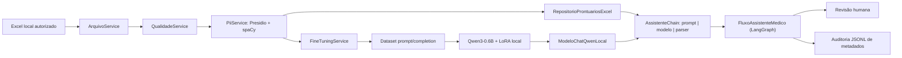
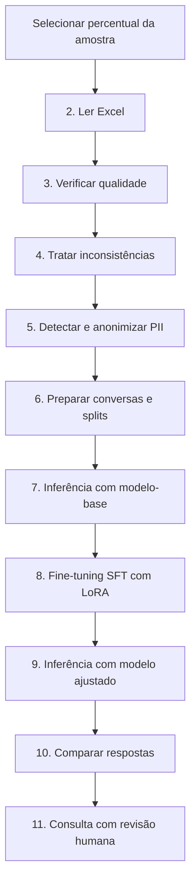
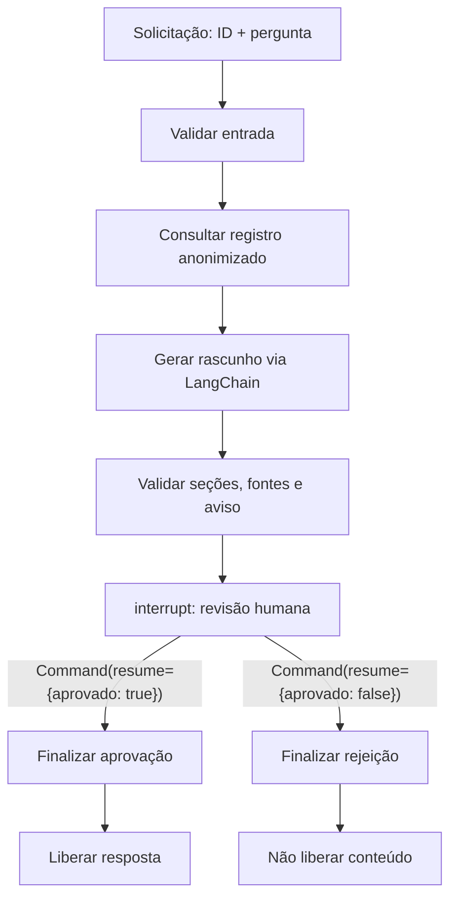

# Fine-tuning de LLM e assistente clínico com LangChain/LangGraph

Relatório técnico do Tech Challenge — Fase 3 da FIAP. O projeto implementa um
pipeline Python 3.12 para preparar e anonimizar dados médicos, ajustar o modelo
[`Qwen/Qwen3-0.6B`](https://huggingface.co/Qwen/Qwen3-0.6B) com SFT/LoRA,
comparar as respostas antes e depois do treinamento e consultar contexto
estruturado por um assistente com revisão humana obrigatória.

> **Uso exclusivamente acadêmico e experimental.** O sistema não foi validado
> como dispositivo médico e não deve diagnosticar, prescrever, recomendar dose,
> realizar triagem de emergência, atualizar prontuários ou tomar qualquer decisão
> clínica autônoma. Toda saída do assistente é um rascunho probabilístico e só é
> liberada depois de uma decisão humana explícita.

## Matriz de atendimento ao enunciado

| Requisito do trabalho | Implementação/evidência | Demonstração recomendada |
| --- | --- | --- |
| Fine-tuning de LLM com dados internos | `FineTuningService` prepara conversas e ajusta o Qwen3-0.6B com LoRA | Executar as opções 6–10 e mostrar apenas métricas agregadas |
| Preprocessing, curadoria e anonimização | `ArquivoService`, `QualidadeService` e `PiiService` | Mostrar relatórios de qualidade e tokens de anonimização, sem expor registros |
| Pipeline LangChain com LLM customizada | `ModeloChatQwenLocal` + `AssistenteChain` com LCEL | Executar a opção 11 com um exemplo autorizado |
| Consulta a base estruturada | `RepositorioProntuariosExcel` consulta um ID único em Excel anonimizado | Mostrar somente os nomes dos campos-fonte recuperados |
| Resposta contextualizada | O contexto atual é serializado como dado não executável no prompt | Comparar pergunta, fontes e rascunho na tela de revisão |
| Limites contra sugestões impróprias | Prompt restritivo, quatro seções obrigatórias, alertas e aviso fixo | Demonstrar rejeição e aprovação humana |
| Logging e auditoria | `ServicoAuditoriaAssistente` grava apenas metadados em JSONL | Exibir uma linha sanitizada, sem pergunta, prontuário ou resposta |
| Código Python modular | Serviços em `app/services/` e assistente em `app/assistente/` | Navegar pela estrutura descrita abaixo |
| Fluxo LangGraph | Grafo de estados, rota condicional, `interrupt` e `Command(resume=...)` | Pausar a execução e retomá-la após a decisão humana |
| Dataset anonimizado ou exemplos sintéticos | O pipeline produz artefato anonimizado localmente; este documento usa exemplo sintético | Não publicar dados clínicos reais |
| Relatório, arquitetura e avaliação | Este README, `FLUXO_PIPELINE.md`, diagramas e critérios de avaliação | Apresentar resultados agregados e limitações |
| Vídeo de até 15 minutos | Roteiro ao final deste documento | Gravar uma execução segura do fluxo |

PubMedQA e MedQuAD são referências sugeridas no enunciado, mas não fazem parte do
código executado. Antes de incorporar qualquer fonte adicional, é necessário
avaliar licença, idioma, autorização, adequação clínica e privacidade.

## Funcionalidades

- leitura e amostragem reproduzível de arquivo Excel;
- identificação e remoção de registros duplicados ou incompletos;
- relatório consolidado de qualidade antes e depois do tratamento;
- detecção de PII/PHI com Microsoft Presidio e spaCy em português;
- reconhecimento específico de CPF e anonimização de campos textuais;
- construção de conversas `system`, `user` e `assistant`;
- divisão reproduzível em treino, validação e teste;
- validações de campos, IDs, splits, duplicidades e quantidade de tokens;
- inferência com o modelo-base;
- Supervised Fine-Tuning com TRL e adaptador LoRA;
- inferência com o modelo ajustado e comparação para avaliação manual;
- consulta estruturada a prontuário anonimizado por ID;
- geração contextualizada via LangChain usando o Qwen/LoRA local;
- fluxo LangGraph com pausa e revisão humana obrigatória;
- auditoria sanitizada e indicação determinística dos campos-fonte.

## Arquitetura



O pipeline principal segue esta sequência:



## Estrutura do projeto

```text
.
├── main.py
├── analisar_tokens.py
├── FLUXO_PIPELINE.md
├── requirements.txt
└── app
    ├── assistente
    │   ├── auditoria.py
    │   ├── chain.py
    │   ├── fluxo.py
    │   ├── modelo_chat.py
    │   ├── modelos.py
    │   └── repositorio.py
    ├── services
    │   ├── arquivo_service.py
    │   ├── qualidade_service.py
    │   ├── pii_service.py
    │   └── fine_tuning_service.py
    ├── data
    │   ├── original
    │   ├── processado
    │   └── relatorios
    └── modelos
        └── qwen3_06b_lora
```

| Caminho | Responsabilidade |
| --- | --- |
| `main.py` | Interface Rich, estado da sessão, atalhos do pipeline e revisão humana |
| `analisar_tokens.py` | Diagnóstico manual da distribuição de tokens |
| `app/services/arquivo_service.py` | Leitura, amostragem e gravação atômica de Excel |
| `app/services/qualidade_service.py` | Relatório e tratamento de duplicidades/ausências |
| `app/services/pii_service.py` | Detecção e anonimização de PII/PHI |
| `app/services/fine_tuning_service.py` | Dataset, treinamento, inferência e avaliação |
| `app/assistente/repositorio.py` | Consulta controlada ao Excel anonimizado |
| `app/assistente/modelo_chat.py` | Adaptador `BaseChatModel` para Qwen/LoRA local |
| `app/assistente/chain.py` | Prompt, LCEL, parser, seções e aviso determinístico |
| `app/assistente/fluxo.py` | Estado LangGraph, pausa e decisão humana |
| `app/assistente/auditoria.py` | Eventos JSONL sem conteúdo clínico |

Uma descrição complementar das etapas está em
[`FLUXO_PIPELINE.md`](FLUXO_PIPELINE.md).

## Tecnologias

- Python 3.12;
- pandas, openpyxl e PyArrow;
- Rich;
- Microsoft Presidio e spaCy;
- PyTorch e Transformers;
- Hugging Face Datasets, Hub e Evaluate;
- TRL e PEFT/LoRA;
- LangChain e LangGraph.

O pacote `langchain-openai` está declarado, mas o fluxo descrito aqui não usa API
externa. O assistente chama somente o Qwen/LoRA local.

## Pré-requisitos

- Python 3.12;
- espaço para o modelo-base e os artefatos de treinamento;
- arquivo Excel compatível e autorizado;
- modelo spaCy `pt_core_news_sm` instalado;
- `Qwen/Qwen3-0.6B` disponível no cache local do Hugging Face.

O treinamento está configurado para CPU e `torch.float32`. Dependendo da amostra
e do hardware, ele pode levar várias horas ou dias.

## Instalação

Execute os comandos dentro de `fine-tunning-llm`.

### 1. Confirmar o Python

```bash
python --version
```

O resultado esperado começa com `Python 3.12`. No Windows também é possível usar
`py -3.12 --version`.

### 2. Criar e ativar o ambiente virtual

Linux ou macOS:

```bash
python3.12 -m venv .venv
source .venv/bin/activate
```

PowerShell:

```powershell
py -3.12 -m venv .venv
.\.venv\Scripts\Activate.ps1
```

Se a política do PowerShell bloquear a ativação, libere scripts apenas na sessão
atual:

```powershell
Set-ExecutionPolicy -Scope Process -ExecutionPolicy Bypass
.\.venv\Scripts\Activate.ps1
```

### 3. Instalar dependências

```bash
python -m pip install --upgrade pip setuptools wheel
python -m pip install -r requirements.txt
python -m pip check
```

`python -m pip freeze` pode ser usado para diagnóstico, mas não é necessário
substituir `requirements.txt` por sua saída.

### 4. Instalar o modelo de português

```bash
python -m spacy download pt_core_news_sm
python -m spacy validate
```

### 5. Preparar o cache do Hugging Face

Use o comando atual `hf`; `huggingface-cli` está descontinuado.

```bash
hf version
hf download Qwen/Qwen3-0.6B
python -c "from huggingface_hub import snapshot_download; print(snapshot_download(repo_id='Qwen/Qwen3-0.6B', local_files_only=True))"
```

O modelo é público e normalmente não exige autenticação. Se o Hub solicitar uma
conta, use `hf auth login` e nunca grave o token no projeto.

O serviço usa `snapshot_download(..., local_files_only=True)`: depois do download
inicial, a execução reutiliza o cache e não inicia downloads automaticamente.

Para usar outro disco, defina `HF_HOME` antes do download e também antes de cada
execução. Escolha um caminho fora do repositório:

```bash
export HF_HOME="/caminho/para/huggingface-cache"
hf download Qwen/Qwen3-0.6B
python main.py
```

No PowerShell, use `$env:HF_HOME = "D:\huggingface-cache"`. Evite `hf download
--local-dir`, pois o código procura o snapshot na estrutura de cache do Hub.

## Preparação do arquivo de entrada

O Excel de origem deve existir em:

```text
app/data/original/dados_medicos_base.xlsx
```

O original é somente leitura; transformações devem ser gravadas nas pastas de
processamento, relatórios ou modelos. As colunas principais esperadas incluem:

- `id`;
- `papel_solicitante`;
- `contexto_solicitacao`;
- `pergunta_original`;
- `prontuario_contexto`;
- `resposta_estruturada`;
- `especialidade_medica`;
- `tipo_pergunta`.

Colunas clínicas adicionais são monitoradas pela qualidade, anonimização e
consulta estruturada. A ausência de campos obrigatórios interrompe a etapa com
mensagem descritiva.

## Execução pelo menu

```bash
python main.py
```

Antes do menu, informe um percentual maior que zero e menor ou igual a 100. O
fluxo tenta garantir ao menos três exemplos para distribuir treino, validação e
teste.

| Opção | Ação | Dependência principal |
| ---: | --- | --- |
| `0` | Executa as etapas 2–6 | Arquivo local autorizado; não inicia treinamento |
| `1` | Executa as etapas 7–10 | Dataset preparado, cache do Qwen e LoRA para 9–10 |
| `2` | Lê e amostra o Excel | Arquivo de origem |
| `3` | Analisa duplicidades e ausências | Etapa 2 na mesma sessão |
| `4` | Remove inconsistências | Etapa 2 na mesma sessão |
| `5` | Detecta e anonimiza PII | Etapa 4 e modelo spaCy |
| `6` | Prepara conversas e splits | Etapas 2–5 e cache do Qwen |
| `7` | Executa inferência-base | Dataset válido e cache do Qwen |
| `8` | Executa SFT/LoRA | Dataset, cache, CPU/RAM/tempo suficientes |
| `9` | Executa inferência ajustada | Dataset, cache e adaptador LoRA |
| `10` | Compara as inferências | Saídas das etapas 7 e 9 |
| `11` | Consulta o assistente com revisão humana | Excel anonimizado, cache e adaptador |
| `12` | Encerra a aplicação | Nenhuma |

Fluxo recomendado: `0` → `1` → `11`. Para executar granularmente, use `2` →
`3` → `4` → `5` → `6` na mesma sessão; depois `7` → `8` → `9` → `10`; por
fim `11`. As etapas isoladas dependem do estado ou dos artefatos produzidos pelas
anteriores.

## Qualidade, preprocessing, curadoria e anonimização

As etapas 3 e 4 verificam e removem registros duplicados ou com campos
monitorados ausentes. A etapa 5 usa Presidio e `pt_core_news_sm` para buscar
`PERSON`, `PHONE_NUMBER`, `DATE_TIME` e `CPF` nas colunas configuradas.

A anonimização integrada produz `pergunta_original_anonimizado` e
`prontuario_contexto_anonimizado`. Substituições incluem marcadores de nome,
telefone, data e CPF; linhas identificadoras do prontuário recebem tratamento
específico.

A detecção automática reduz risco, mas não garante remoção completa de PII/PHI.
A curadoria humana deve revisar falsos positivos/negativos, minimização, base
legal, retenção, controle de acesso e aderência à LGPD. Revise também
`papel_solicitante`, `contexto_solicitacao` e `resposta_estruturada`, pois esses
campos participam das conversas.

## Dataset conversacional

A etapa 6 produz um Excel com:

| Campo | Finalidade |
| --- | --- |
| `id_exemplo` | Identificador único |
| `system` | Política de comportamento e formato |
| `user` | Papel, solicitação, prontuário e pergunta anonimizados |
| `assistant` | Resposta de referência |
| `especialidade_medica` | Metadado preservado |
| `tipo_pergunta` | Metadado preservado |
| `total_okens_fine_tunning` | Quantidade de tokens; grafia legada mantida pelo código |
| `split` | `treino`, `validacao` ou `teste` |

As conversas são convertidas em `prompt` (`system` + `user`) e `completion`
(`assistant`), com perda calculada apenas sobre a completion. O split usa seed 42
e alvo 80%/10%/10%, preservando ao menos um item de validação e um de teste em
conjuntos pequenos. Exemplos com 512 tokens ou mais são removidos, e os splits
são recalculados. O conjunto de teste não participa do `SFTTrainer`.

Exemplo exclusivamente sintético:

```json
{
  "id_exemplo": "DEMO-0001",
  "system": "Você é um assistente acadêmico de apoio clínico...",
  "user": "Prontuário fictício sem identificadores. Quais pontos devem ser revisados?",
  "assistant": "Resposta: exemplo sintético. Considerações clínicas: revisar contexto. Conduta/Orientação: submeter ao profissional. Limitações: não é orientação clínica.",
  "split": "teste"
}
```

## Fine-tuning do Qwen3-0.6B

| Parâmetro | Valor implementado |
| --- | --- |
| Modelo-base | `Qwen/Qwen3-0.6B` |
| Método | SFT com TRL e PEFT/LoRA para `CAUSAL_LM` |
| Dispositivo e precisão | CPU, `torch.float32` |
| Limite da sequência | 512 tokens |
| Épocas | 3 |
| Learning rate | `1e-4` |
| Lote por dispositivo | 1 |
| Acumulação / lote efetivo | 8 / 8 |
| LoRA | `r=16`, alpha 32, dropout 0,05, `bias="none"` |
| Módulos ajustados | `q_proj` e `v_proj` |
| Avaliação e checkpoint | A cada época; até 2 checkpoints; melhor por `eval_loss` |
| Reprodutibilidade | `seed=42` e `data_seed=42` |
| Geração | Determinística, sem thinking, até 384 tokens novos |
| Inferências comparativas | 3 exemplos de teste por padrão |

O tokenizer aplica o chat template do Qwen com `enable_thinking=False`; a
entrada é truncada à esquerda. Resultados ainda podem variar por versões,
hardware e dados locais.

## Resultado experimental registrado na main

Uma execução com 10% dos dados produziu 1.303 exemplos elegíveis: 1.042 de
treino, 130 de validação e 131 de teste.

| Métrica de validação | Modelo-base | Modelo ajustado |
| --- | ---: | ---: |
| Loss | 2,5002 | 0,6778 |
| Perplexidade | aproximadamente 12,18 | 1,97 |
| Acurácia média por token | 52,12% | 86,41% |
| Entropia | 1,5878 | 0,6783 |

O treinamento registrado realizou 393 passos em aproximadamente 10h29min na
CPU. Foram ajustados 2.293.760 de 598.344.000 parâmetros, cerca de 0,383% do
total. Esses números evidenciam convergência técnica no conjunto de validação,
mas não comprovam precisão, utilidade ou segurança clínica.

## Avaliação das inferências

A etapa 7 gera respostas do modelo-base, a 9 gera respostas do modelo ajustado e
a 10 exige os mesmos IDs/mensagens para criar uma comparação lado a lado com a
referência. A avaliação manual deve considerar:

- aderência às quatro seções exigidas;
- estrutura e relevância clínica;
- fidelidade ao contexto e aos campos-fonte;
- alucinação e afirmações sem sustentação;
- segurança da orientação;
- exposição de PII/PHI;
- limitações e capacidade de generalização.

Loss, perplexidade e acurácia por token não substituem avaliação humana nem
validação clínica.

## Assistente com LangChain e dados estruturados

`ModeloChatQwenLocal` implementa `BaseChatModel`, reúne mensagens de sistema e
usuário e chama `FineTuningService.gerar_resposta_modelo_ajustado`. Não há envio
do contexto a um provedor externo.

`AssistenteChain` monta um `ChatPromptTemplate` e compõe LCEL:

```text
prompt | ModeloChatQwenLocal | StrOutputParser
```

O contexto estruturado é serializado como JSON e tratado como dado não
executável. Instruções encontradas dentro do prontuário não devem ser obedecidas.

`RepositorioProntuariosExcel` busca exatamente um ID e recusa registro ausente ou
duplicado. A allowlist expõe somente campos não vazios como prontuário
anonimizado, hipótese, diagnóstico, exames, medicamentos, alergias, antecedentes
e especialidade. As “fontes” mostradas ao revisor são os nomes desses campos,
não referências científicas inventadas pela LLM.

O rascunho deve conter:

1. `Resposta`;
2. `Considerações clínicas`;
3. `Conduta/Orientação`;
4. `Limitações`.

## LangGraph e revisão humana



O estado passa pelos nós `validar_entrada`, `consultar_registro`,
`gerar_rascunho`, `validar_seguranca`, `solicitar_revisao_humana`,
`finalizar_aprovacao` e `finalizar_rejeicao`. O grafo usa `InMemorySaver`,
adequado à demonstração local, mas não a persistência clínica durável.

Na opção 11, a interface mostra rascunho, fontes, alertas e aviso e exige `s` ou
`n`, além de observação opcional. Somente a rota aprovada copia o rascunho para a
resposta pública; a rejeição não libera conteúdo.

Exemplo sintético:

```text
Opção: 11
ID do registro: DEMO-0001
Pergunta clínica: Em um cenário fictício, quais pontos exigem revisão?
Decisão do revisor: s
Observação: Aprovação exclusivamente demonstrativa.
```

## Auditoria, segurança e explicabilidade

- o prompt proíbe diagnóstico, prescrição e ação automática;
- a chain verifica seções, fontes e aviso;
- o repositório usa allowlist e correspondência única de ID;
- o log JSONL aceita somente horário UTC, UUID de execução, etapa, situação,
  nomes dos campos-fonte, códigos de alerta, decisão humana e tipo de erro;
- ID do registro, pergunta, prontuário, rascunho, resposta e observação não são
  persistidos pelo serviço de auditoria;
- o payload do `interrupt` pertence à sessão e não ao log permanente;
- indicar os campos consultados oferece rastreabilidade, mas não explica o
  raciocínio interno do modelo nem constitui evidência científica;
- controles institucionais de acesso, criptografia, retenção, segredos, LGPD e
  governança continuam necessários.

Nunca versione dados brutos ou arquivos com PII/PHI. Não publique datasets,
adaptadores, checkpoints ou modelos adicionais sem revisão e autorização.

## Artefatos gerados

| Caminho | Conteúdo |
| --- | --- |
| `app/data/processado/dados_medicos_auditoria.xlsx` | Registros tratados e informações de PII |
| `app/data/processado/dados_medicos_fine_tuning.xlsx` | Conversas, tokens, metadados e splits |
| `app/data/relatorios/relatorio_qualidade.xlsx` | Qualidade antes/depois |
| `app/data/relatorios/avaliacao_inferencias.xlsx` | Referência, modelo-base, ajustado e avaliação manual |
| `app/data/relatorios/metricas_fine_tuning.txt` | Métricas agregadas |
| `app/data/relatorios/relatorio_tecnico_fine_tuning.xlsx` | Avaliação técnica do treinamento |
| `app/data/relatorios/auditoria_assistente.jsonl` | Metadados do fluxo do assistente |
| `app/modelos/qwen3_06b_lora/` | Adaptador, tokenizer e checkpoints |

Trate todos esses artefatos como locais e potencialmente sensíveis.

## Validação sem carregar dados ou modelo

O projeto não mantém suíte unitária versionada. Estas verificações não executam
o pipeline, não abrem o Excel e não carregam o modelo:

```bash
python -m compileall main.py analisar_tokens.py app/services app/assistente
python -c "from app.assistente import AssistenteChain, FluxoAssistenteMedico, ModeloChatQwenLocal"
git diff --check
```

`analisar_tokens.py` acessa o dataset preparado; execute-o somente quando houver
autorização para utilizar os dados.

## Troubleshooting

| Situação | Ação segura |
| --- | --- |
| `hf` ou modelo não encontrado | Rode `hf download Qwen/Qwen3-0.6B` com o mesmo usuário, ambiente e `HF_HOME` |
| Modelo spaCy ausente | Rode `python -m spacy download pt_core_news_sm` |
| Etapa 6 recusa colunas/valores/splits | Refaça qualidade e anonimização e revise a curadoria local |
| Menos de três exemplos elegíveis | Aumente apenas a amostra autorizada ou revise o limite de tokens |
| Registro ausente/duplicado na opção 11 | Corrija o artefato anonimizado; a consulta exige uma correspondência |
| Rascunho sem seções/fontes/aviso | Não aprove; mantenha a validação e investigue o fluxo |
| Processo encerrou durante a revisão | Recomece; `InMemorySaver` não persiste a interrupção |
| Treinamento lento | Planeje CPU/RAM/tempo e documente qualquer redução do experimento |

## Limitações conhecidas

- treinamento em CPU demorado;
- limite de 512 tokens pode excluir casos extensos e introduzir viés;
- anonimização automática pode deixar escapar PII/PHI;
- campos que entram na conversa ainda exigem curadoria humana;
- inferências comparativas usam três casos de teste por padrão;
- avaliação clínica permanece manual;
- `especialidade_medica` e `tipo_pergunta` são metadados e não entram no prompt
  de treinamento;
- o adaptador depende dos pesos do modelo-base;
- contexto estruturado não equivale a evidência científica;
- `InMemorySaver` não mantém revisões após o encerramento do processo.

## Roteiro do vídeo — até 15 minutos

1. **0:00–1:00 — objetivo e limites:** escopo acadêmico, aviso médico e privacidade.
2. **1:00–3:30 — preparação:** opções 2–6, qualidade, Presidio/spaCy e dataset; não mostrar dados reais.
3. **3:30–6:30 — treinamento:** Qwen, SFT/LoRA, CPU, splits, parâmetros e métricas agregadas.
4. **6:30–9:00 — avaliação:** opções 7–10, comparação base/ajustado e critérios humanos.
5. **9:00–13:00 — assistente:** LangChain, consulta estruturada, LangGraph, rejeição e aprovação.
6. **13:00–15:00 — auditoria e conclusão:** log sanitizado, limitações e controles necessários.

## Checklist de entrega

- [x] pipeline de preprocessing, qualidade e anonimização;
- [x] fine-tuning Qwen3-0.6B com SFT/LoRA;
- [x] métricas experimentais agregadas documentadas;
- [x] comparação de inferências preparada para avaliação humana;
- [x] integração LangChain com modelo local e base estruturada;
- [x] fluxo LangGraph com aprovação humana obrigatória;
- [x] auditoria sanitizada e campos-fonte;
- [x] relatório técnico, diagramas, comandos e roteiro do vídeo;
- [ ] avaliação clínica final das respostas;
- [ ] vídeo final gravado e revisado.

## Referências

- [LangChain — visão geral](https://docs.langchain.com/oss/python/langchain/overview)
- [LangChain Expression Language](https://python.langchain.com/docs/concepts/lcel/)
- [LangGraph — visão geral](https://docs.langchain.com/oss/python/langgraph/overview)
- [LangGraph — interrupts](https://docs.langchain.com/oss/python/langgraph/interrupts)
- [Hugging Face Hub — download e cache](https://huggingface.co/docs/huggingface_hub/guides/download)
- [Transformers — treinamento](https://huggingface.co/docs/transformers/training)
- [PEFT — LoRA](https://huggingface.co/docs/peft/main/en/conceptual_guides/lora)
- [TRL — SFTTrainer](https://huggingface.co/docs/trl/sft_trainer)
- [Microsoft Presidio](https://microsoft.github.io/presidio/)
- [spaCy — modelos em português](https://spacy.io/models/pt)
- [Qwen3-0.6B](https://huggingface.co/Qwen/Qwen3-0.6B)
- [PubMedQA](https://pubmedqa.github.io/)
- [MedQuAD](https://github.com/abachaa/MedQuAD)

## Glossário

| Termo | Definição neste projeto |
| --- | --- |
| PII/PHI | Informação pessoal ou de saúde identificável que deve ser minimizada e protegida |
| Preprocessing | Leitura, checagem, limpeza e estruturação antes do treinamento |
| Curadoria | Revisão humana de qualidade, adequação, autorização e privacidade |
| SFT | Ajuste supervisionado do modelo com prompts e respostas esperadas |
| LoRA | Adaptador de baixo rank que treina uma pequena parcela dos parâmetros |
| Split | Partição separada para treino, validação ou teste |
| Token | Unidade processada pelo tokenizer e usada no limite de contexto |
| LangChain / LCEL | Biblioteca e composição declarativa de prompt, modelo e parser |
| LangGraph | Orquestrador de estados, rotas e pausas do fluxo |
| `interrupt` / `Command` | Pausa para revisão humana e retomada com a decisão |
| Explainability | Indicação determinística dos campos consultados; não é explicação científica da LLM |

## Licenças e responsabilidade

O modelo-base Qwen3-0.6B é distribuído sob Apache 2.0. Verifique separadamente
as licenças do código, dataset e artefatos produzidos. O uso do repositório e de
seus resultados é responsabilidade do usuário e deve respeitar autorizações,
políticas institucionais e legislação aplicável.
