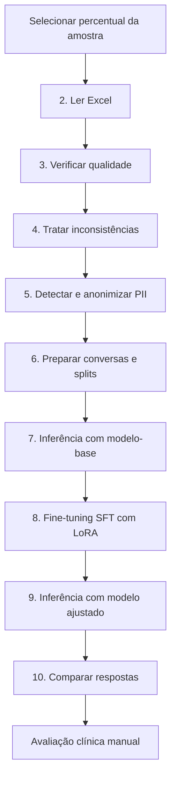

# Fine-tuning de LLM para apoio clínico

Pipeline em Python para preparar dados médicos, detectar e anonimizar PII/PHI,
realizar fine-tuning supervisionado com LoRA e comparar as respostas do
[`Qwen/Qwen3-0.6B`](https://huggingface.co/Qwen/Qwen3-0.6B) antes e depois do
ajuste.

O projeto foi desenvolvido para o Tech Challenge — Fase 3 da FIAP e é executado
por uma interface de console construída com Rich.

> **Aviso:** este projeto é acadêmico e experimental. O modelo não foi validado
> como dispositivo médico e não deve ser usado para diagnóstico, prescrição,
> triagem de emergência ou qualquer decisão clínica autônoma.

## Funcionalidades

- leitura e amostragem reproduzível de um arquivo Excel;
- identificação e remoção de registros duplicados ou incompletos;
- geração de relatório consolidado de qualidade antes e depois do tratamento;
- detecção de PII com Microsoft Presidio e spaCy em português;
- reconhecimento específico de CPF;
- anonimização de perguntas e contextos de prontuário;
- construção de conversas nos papéis `system`, `user` e `assistant`;
- divisão reproduzível em treino, validação e teste;
- validação de campos, identificadores, splits, duplicidades e tokens;
- inferência com o modelo-base;
- Supervised Fine-Tuning com TRL e adaptador LoRA;
- inferência com o modelo ajustado;
- comparação das respostas em um relatório destinado à avaliação manual.

## Fluxo do pipeline



O menu também oferece dois atalhos:

| Opção | Ação |
|---:|---|
| `0` | Executa as etapas 2 a 6 para preparar os dados |
| `1` | Executa as etapas 7 a 10 para treinar e avaliar |
| `11` | Encerra a aplicação |

O treinamento não é iniciado pela opção `0`. Ele permanece uma ação explícita
na opção `1` ou na etapa `8`.

Uma descrição detalhada de cada etapa está disponível em
[`FLUXO_PIPELINE.md`](FLUXO_PIPELINE.md).

## Tecnologias

- Python 3.12;
- pandas, openpyxl e PyArrow;
- Rich;
- Microsoft Presidio e spaCy;
- PyTorch e Transformers;
- Hugging Face Datasets, Hub e Evaluate;
- TRL e PEFT/LoRA.

## Pré-requisitos

- Python 3.12;
- espaço disponível para o modelo-base e os artefatos de treinamento;
- arquivo Excel de entrada no formato esperado;
- modelo spaCy `pt_core_news_sm` instalado;
- `Qwen/Qwen3-0.6B` disponível no cache local do Hugging Face.

O treinamento está configurado para CPU com `torch.float32`. Dependendo do
tamanho da amostra e do hardware, a etapa pode levar várias horas ou dias.

## Instalação

Crie e ative um ambiente virtual.

No PowerShell:

```powershell
python -m venv .venv
.\.venv\Scripts\Activate.ps1
```

No Linux ou macOS:

```bash
python -m venv .venv
source .venv/bin/activate
```

Instale as dependências:

```bash
python -m pip install --upgrade pip
python -m pip install -r requirements.txt
```

Instale o modelo de português usado pelo Presidio:

```bash
python -m spacy download pt_core_news_sm
```

Baixe o modelo-base para o cache local:

```bash
hf download Qwen/Qwen3-0.6B
```

O projeto usa o comando atual `hf`. O comando antigo `huggingface-cli` não é
necessário.

## Preparação do arquivo de entrada

Coloque o Excel original no caminho:

```text
app/data/original/dados_medicos_base.xlsx
```

O arquivo original é tratado como somente leitura. Os resultados são gravados
exclusivamente nas pastas de processamento, relatórios e modelos.

As principais colunas esperadas pelo fluxo incluem:

- `id`;
- `papel_solicitante`;
- `contexto_solicitacao`;
- `pergunta_original`;
- `prontuario_contexto`;
- `resposta_estruturada`;
- `especialidade_medica`;
- `tipo_pergunta`.

Outras colunas clínicas são monitoradas nas etapas de qualidade e detecção de
PII. A ausência de colunas obrigatórias interrompe a etapa correspondente com
uma mensagem descritiva.

## Execução

Inicie a aplicação:

```bash
python main.py
```

Antes de abrir o menu, o programa solicita o percentual do conjunto que será
utilizado. O valor deve ser maior que zero e menor ou igual a 100. Quando
possível, o fluxo garante ao menos três registros para que treino, validação e
teste recebam exemplos.

Para uma primeira execução:

1. escolha uma amostra pequena para validar o ambiente;
2. execute a opção `0` para preparar os dados;
3. revise os relatórios de qualidade e anonimização;
4. execute a opção `1` somente quando estiver pronto para iniciar o treinamento;
5. revise manualmente a comparação das inferências.

As etapas individuais podem ser usadas para diagnóstico, mas algumas dependem
do estado criado por etapas anteriores na mesma sessão.

## Etapas

| Etapa | Descrição | Resultado principal |
|---:|---|---|
| 2 | Leitura e amostragem do Excel | DataFrame em memória |
| 3 | Identificação de duplicidades e ausências | Relatório inicial de qualidade |
| 4 | Remoção das inconsistências | Arquivo de auditoria tratado |
| 5 | Identificação e tratamento de PII | Arquivo de auditoria anonimizado |
| 6 | Construção das conversas e splits | Dataset preparado para fine-tuning |
| 7 | Inferência com o Qwen3 original | Respostas do modelo-base |
| 8 | SFT com adaptador LoRA | Adaptador, métricas e relatório técnico |
| 9 | Inferência com o adaptador | Respostas do modelo ajustado |
| 10 | Validação e comparação | Planilha para avaliação manual |

## Artefatos gerados

| Caminho | Conteúdo |
|---|---|
| `app/data/processado/dados_medicos_auditoria.xlsx` | Registros tratados e informações de PII |
| `app/data/processado/dados_medicos_fine_tuning.xlsx` | Conversas, metadados, tokens e splits |
| `app/data/relatorios/relatorio_qualidade.xlsx` | Qualidade antes e depois do tratamento |
| `app/data/relatorios/avaliacao_inferencias.xlsx` | Respostas esperada, base e ajustada |
| `app/data/relatorios/metricas_fine_tuning.txt` | Métricas e estatísticas agregadas |
| `app/data/relatorios/relatorio_tecnico_fine_tuning.xlsx` | Avaliação técnica do treinamento |
| `app/modelos/qwen3_06b_lora/` | Adaptador LoRA, tokenizer e checkpoints |

Esses artefatos são ignorados pelo Git porque podem conter dados sensíveis ou
arquivos grandes.

## Detecção e anonimização de PII

O Presidio utiliza o modelo `pt_core_news_sm` e procura as entidades:

- pessoa;
- telefone;
- data;
- CPF.

O fluxo analisa as colunas configuradas e registra se cada linha possui PII. A
anonimização integrada transforma especificamente `pergunta_original` e
`prontuario_contexto`, produzindo as versões:

- `pergunta_original_anonimizado`;
- `prontuario_contexto_anonimizado`.

A detecção automatizada reduz o risco, mas não garante a remoção completa de
PII/PHI. Antes de usar dados reais, revise também `papel_solicitante`,
`contexto_solicitacao` e `resposta_estruturada`, pois esses campos participam
das conversas de treinamento.

## Dataset conversacional

O arquivo preparado contém:

| Campo | Finalidade |
|---|---|
| `id_exemplo` | Identificador único |
| `system` | Instruções de comportamento e formato |
| `user` | Papel, solicitação, contexto anonimizado e pergunta |
| `assistant` | Resposta esperada |
| `especialidade_medica` | Metadado preservado |
| `tipo_pergunta` | Metadado preservado |
| `total_okens_fine_tunning` | Quantidade de tokens da conversa |
| `split` | `treino`, `validacao` ou `teste` |

O nome `total_okens_fine_tunning` mantém uma grafia legada usada pelos artefatos
e pelo código atual.

Os dados são divididos de forma reproduzível:

- 80% para treino;
- 10% para validação;
- 10% para teste;
- seed 42;
- pelo menos um exemplo por split.

Registros com 512 tokens ou mais são removidos antes do treinamento e os splits
são recalculados sobre os exemplos elegíveis. O split de teste não participa do
`SFTTrainer`.

## Configuração do modelo

| Parâmetro | Valor padrão |
|---|---:|
| Modelo-base | `Qwen/Qwen3-0.6B` |
| Dispositivo | CPU |
| Precisão | `torch.float32` |
| Limite da sequência | 512 tokens |
| Épocas | 3 |
| Learning rate | `1e-4` |
| Lote por dispositivo | 1 |
| Acumulação de gradiente | 8 |
| Lote efetivo | 8 |
| LoRA rank | 16 |
| LoRA alpha | 32 |
| LoRA dropout | 0,05 |
| Módulos ajustados | `q_proj` e `v_proj` |
| Geração por inferência | Até 384 novos tokens |
| Exemplos de teste por padrão | 3 |

O treinamento usa conversas `prompt`/`completion` e calcula a perda somente
sobre a resposta esperada com `completion_only_loss=True`. O modo de raciocínio
do Qwen3 é desativado por `enable_thinking=False`.

O modelo e o tokenizer são carregados apenas do cache local com
`local_files_only=True`; o pipeline não inicia downloads automaticamente.

## Resultado experimental com 10% dos dados

Em uma execução com 1.303 exemplos elegíveis — 1.042 de treino, 130 de validação
e 131 de teste — foram observados:

| Métrica de validação | Modelo-base | Modelo ajustado |
|---|---:|---:|
| Loss | 2,5002 | 0,6778 |
| Perplexidade | aproximadamente 12,18 | 1,97 |
| Acurácia média por token | 52,12% | 86,41% |
| Entropia | 1,5878 | 0,6783 |

O treinamento realizou 393 passos em aproximadamente 10h29min na CPU. Apenas
2.293.760 de 598.344.000 parâmetros foram ajustados, cerca de 0,383% do total.

Esses números demonstram convergência técnica no conjunto de validação, mas não
comprovam precisão, utilidade ou segurança clínica. A avaliação final exige
revisão humana das respostas do split de teste.

## Avaliação das inferências

O arquivo `avaliacao_inferencias.xlsx` reúne:

- mensagens `system` e `user`;
- resposta esperada;
- resposta do modelo-base;
- resposta do modelo ajustado;
- campos de avaliação manual.

Os critérios manuais previstos são:

- estrutura;
- relevância clínica;
- alucinação;
- exposição de PII;
- observações do avaliador.

Loss, perplexidade e acurácia por token não substituem essa avaliação.

## Estrutura do projeto

```text
.
├── main.py
├── analisar_tokens.py
├── FLUXO_PIPELINE.md
├── requirements.txt
└── app
    ├── services
    │   ├── arquivo_service.py
    │   ├── qualidade_service.py
    │   ├── pii_service.py
    │   └── fine_tuning_service.py
    ├── data
    │   ├── original
    │   ├── processado
    │   └── relatorios
    └── modelos
        └── qwen3_06b_lora
```

### Responsabilidades

- `main.py`: interface Rich e orquestração das etapas;
- `arquivo_service.py`: leitura, amostragem e gravação atômica de Excel;
- `qualidade_service.py`: análise e tratamento de qualidade;
- `pii_service.py`: detecção e anonimização de PII;
- `fine_tuning_service.py`: preparação, treinamento, inferência e avaliação;
- `analisar_tokens.py`: diagnóstico manual da distribuição de tokens.

## Validação do código

O projeto não possui testes automatizados. Para validar a sintaxe sem executar o
pipeline nem carregar os dados, use:

```bash
python -m compileall main.py analisar_tokens.py app/services
```

O script `analisar_tokens.py` acessa o dataset preparado e deve ser executado
somente quando houver autorização para utilizar esses dados:

```bash
python analisar_tokens.py
```

## Segurança e privacidade

- nunca versione dados brutos ou arquivos com PII/PHI;
- mantenha o arquivo original inalterado;
- trate relatórios e prompts como potencialmente sensíveis;
- não publique datasets, adaptadores ou checkpoints sem revisão e autorização;
- revise todos os campos que entram no treinamento;
- faça avaliação clínica e de privacidade antes de qualquer implantação;
- não armazene tokens do Hugging Face ou outras credenciais no repositório.

## Limitações conhecidas

- o treinamento padrão ocorre em CPU e pode ser demorado;
- o limite de 512 tokens pode excluir casos extensos e introduzir viés;
- a anonimização automática pode deixar escapar PII/PHI;
- alguns campos usados na conversa não são anonimizados diretamente pelo fluxo;
- as inferências processam três exemplos de teste por padrão;
- a avaliação clínica permanece manual;
- `especialidade_medica` e `tipo_pergunta` são metadados, mas não fazem parte do
  prompt usado pelo treinamento;
- o adaptador depende dos pesos do modelo-base para inferência.

## Licenças e responsabilidades

O modelo-base `Qwen/Qwen3-0.6B` é distribuído sob a licença Apache 2.0. Verifique
separadamente as licenças e autorizações aplicáveis ao código deste projeto, ao
dataset utilizado e aos artefatos produzidos pelo fine-tuning.

O uso deste repositório e de seus resultados é de responsabilidade do usuário.
