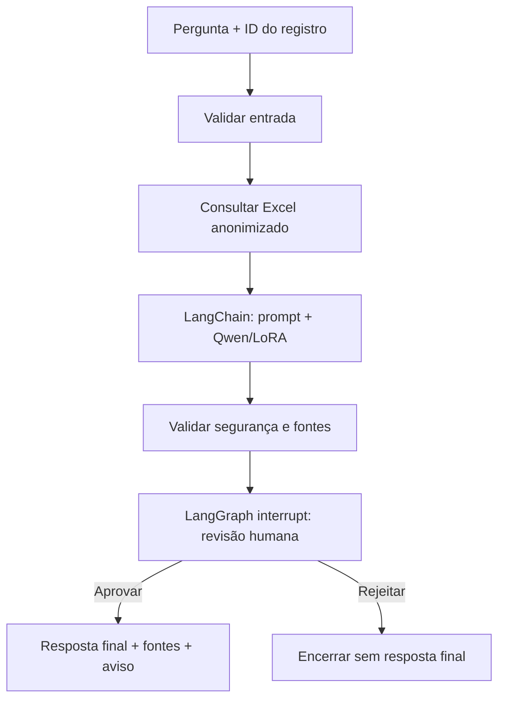

# Pipeline local e assistente médico demonstrável

Este subprojeto é um exercício acadêmico de preparação de dados, anonimização,
fine-tuning local do Qwen3-0.6B com LoRA e um assistente de apoio clínico
demonstrável. Ele não é dispositivo médico, não substitui avaliação profissional
e não deve orientar diagnóstico, prescrição, tratamento ou decisões clínicas
reais.

## Instalação

Use Python 3.12 e um ambiente virtual no diretório `fine-tunning-llm`:

```bash
python3.12 -m venv .venv
source .venv/bin/activate
python -m pip install -r requirements.txt
```

O pipeline de identificação de PII também requer o modelo local do spaCy:

```bash
python -m spacy download pt_core_news_sm
```

Não há chave de API nem provedor remoto de LLM nesta demonstração. Os modelos,
adaptadores, checkpoints e dados usados em uma execução real devem permanecer
locais e fora do versionamento.

## Preparação local antes do assistente

A opção `11` pressupõe que as etapas `2` a `10` já foram preparadas/executadas
localmente conforme o objetivo da demonstração:

| Etapas | Pré-requisito para a demonstração |
| --- | --- |
| 2 a 5 | O Excel de origem foi processado, verificado e anonimizado; o arquivo de auditoria anonimizado foi produzido localmente. |
| 6 | O dataframe conversacional para fine-tuning foi preparado e validado. |
| 7 | A inferência-base foi executada com o Qwen armazenado no cache local. |
| 8 | O fine-tuning foi concluído e o adaptador LoRA foi salvo localmente. |
| 9 e 10 | A inferência ajustada e a comparação com a base foram geradas para avaliação manual. |

Para as etapas 7 a 10, obtenha o modelo-base uma única vez no cache local e
execute o treinamento explicitamente, quando autorizado para o seu ambiente:

```bash
hf download Qwen/Qwen3-0.6B
```

O adaptador esperado pelo assistente é o LoRA local produzido na etapa 8, em
`app/modelos/qwen3_06b_lora/`. A fonte de consulta é o Excel anonimizado
produzido localmente em `app/data/processado/dados_medicos_auditoria.xlsx`.
Não copie, publique ou versione datasets, adaptadores, checkpoints ou modelos.

Se o modelo-base não estiver no cache ou se o adaptador LoRA não existir, a
geração não deve ser iniciada: prepare os artefatos com as etapas anteriores e
tente novamente. Se o Excel anonimizado não existir, estiver sem as colunas
`id` e `prontuario_contexto_anonimizado`, ou o identificador não tiver uma
única correspondência, corrija o pipeline de dados antes de consultar o
assistente.

## Execução e opção 11

Inicie o menu no diretório deste arquivo:

```bash
python main.py
```

A opção `11` (**Consultar assistente médico com revisão humana**) solicita o
identificador do registro e uma pergunta. O sistema valida ambos, consulta
apenas os campos permitidos do Excel anonimizado e monta um rascunho por uma
chain LangChain que chama o adaptador `ModeloChatQwenLocal`. Esse adaptador
usa a inferência local já oferecida pelo `FineTuningService` com Qwen/LoRA;
ele não baixa modelo, não executa ferramenta e não chama serviço remoto.

O fluxo pausa obrigatoriamente para revisão. O revisor vê o rascunho, as fontes
e os alertas e informa `s` para aprovar ou `n` para rejeitar, além de uma
observação opcional. A aprovação libera a resposta final com fontes e aviso;
a rejeição encerra a execução sem liberar o rascunho como resposta final.



### Exemplo inteiramente sintético

Use somente um ambiente de demonstração com conteúdo fictício, como este:

```text
Opção: 11
ID do registro: DEMO-0001
Pergunta: Em um caso fictício, quais pontos devem ser revisados pelo profissional?
Decisão do revisor: s
Observação do revisor: Exemplo aprovado apenas para demonstração.
```

Nesse cenário, `DEMO-0001`, a pergunta e a observação são textos sintéticos.
Não cole nomes, documentos, prontuários, sintomas identificáveis ou qualquer
PHI/PII no terminal, em exemplos, issues ou logs.

## Arquitetura, fontes e auditoria

`RepositorioProntuariosExcel` recupera exatamente um registro e expõe somente
campos permitidos e não vazios. As fontes apresentadas ao revisor e na resposta
aprovada são os nomes desses campos recuperados pelo repositório; elas não são
inventadas pela LLM. `AssistenteChain` aplica um `ChatPromptTemplate`, exige as
seções **Resposta**, **Considerações clínicas**, **Conduta/Orientação** e
**Limitações**, e acrescenta de modo determinístico as fontes e o aviso de
revisão humana.

`FluxoAssistenteMedico` é um `StateGraph` com estado serializável, nós de
validação/consulta/geração/segurança/finalização, aresta condicional entre
aprovação e rejeição, checkpointer `InMemorySaver` e `interrupt` obrigatório
antes da liberação. A decisão é retomada por `Command(resume=...)`; somente
`aprovado: true` copia o rascunho para a resposta pública.

O `ServicoAuditoriaAssistente` registra JSON Lines apenas com metadados:
horário UTC, ID aleatório da execução, etapa, situação, nomes dos campos-fonte,
códigos de alerta, decisão humana e tipo de erro. Ele nunca aceita nem grava
ID do registro, pergunta, prontuário, rascunho, resposta ou observação humana.
O payload do `interrupt` fica restrito à sessão de revisão e não é enviado ao
log.

## Erros esperados

- Identificador ou pergunta vazios: revise a entrada e reinicie a opção `11`.
- Registro ausente ou duplicado: corrija o Excel anonimizado local; não tente
  contornar a validação com outro arquivo de dados clínicos.
- Colunas obrigatórias ausentes: execute novamente as etapas de preparação e
  anonimização até produzir o artefato compatível.
- Qwen base ou LoRA local ausente: baixe o modelo para o cache local e execute
  o fine-tuning da etapa 8; não há fallback remoto.
- Rascunho sem seções, fontes ou aviso: o fluxo gera alertas e ainda exige
  revisão humana; não trate o rascunho como resposta final.
- Decisão humana inválida: informe apenas `s` ou `n`; nenhum conteúdo é
  liberado enquanto a decisão não for válida.

## Limitações e segurança

- A saída é um rascunho probabilístico e pode estar incompleta, incorreta,
  desatualizada ou alucinar; avaliação humana qualificada é obrigatória.
- O sistema não diagnostica, prescreve, executa condutas nem atualiza
  prontuários.
- `InMemorySaver` é apropriado apenas para a demonstração local: interrupções
  não devem ser consideradas persistidas após o processo encerrar.
- A origem é limitada aos campos disponíveis no Excel anonimizado; fontes
  indicam campos consultados, não validação científica ou evidência clínica.
- A preparação de dados, a anonimização e o uso de artefatos locais continuam
  sujeitos a revisão de privacidade, governança e autorização institucional.

## Referências oficiais

- [LangChain — visão geral](https://docs.langchain.com/oss/python/langchain/overview)
- [LangChain — modelos de chat](https://docs.langchain.com/oss/python/langchain/models)
- [LangGraph — visão geral](https://docs.langchain.com/oss/python/langgraph/overview)
- [LangGraph — interrupções e revisão humana](https://docs.langchain.com/oss/python/langgraph/interrupts)
